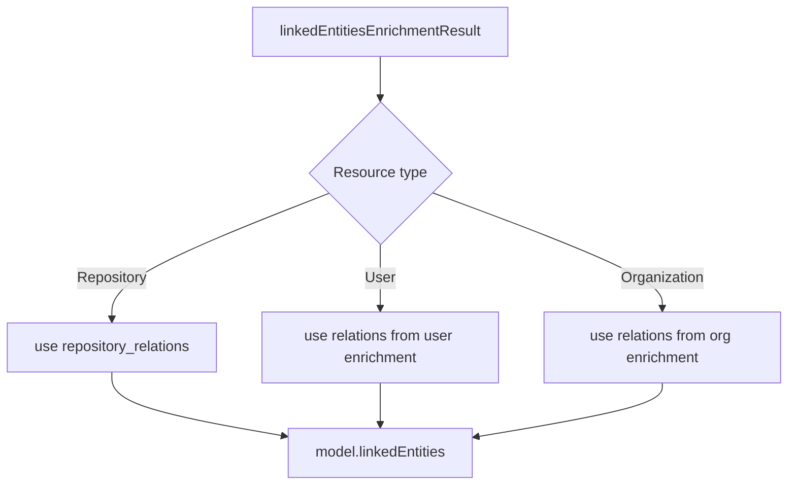

# Academic Catalog Enrichment - Assignment Strategy (Current)

This page documents how linked-entity results are assigned to output models in the current code.

## Current assignment behavior

1. Repository analysis (`src/analysis/repositories.py`)
- Runs two-stage linked-entity pipeline:
  - `search_academic_catalogs`
  - `structure_linked_entities`
- Assigns only `repository_relations` to `SoftwareSourceCode.linkedEntities`.
- Author-level linked entities are not yet fully materialized (follow-up method exists).

2. User analysis (`src/analysis/user.py`)
- Uses `enrich_user_linked_entities`.
- Assigns resulting relations directly to `GitHubUser.linkedEntities`.

3. Organization analysis (`src/analysis/organization.py`)
- Uses `enrich_organization_linked_entities`.
- Assigns resulting relations directly to `GitHubOrganization.linkedEntities`.

## Data structure reference

`linkedEntitiesEnrichmentResult` contains:

- `repository_relations: list[linkedEntitiesRelation]`
- `author_relations: dict[str, list[linkedEntitiesRelation]]`
- `organization_relations: dict[str, list[linkedEntitiesRelation]]`

## Assignment flow

## Why this strategy

- Keeps assignment deterministic and avoids ambiguous name matching in the hot path.
- Preserves room for richer per-author assignment logic without destabilizing repository baseline responses.
