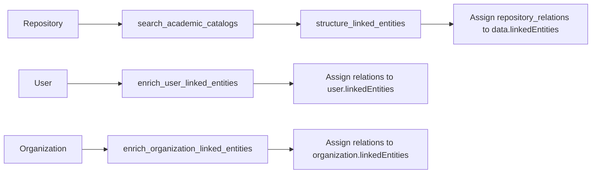

# Academic Catalog Refactor Summary

This summary reflects the current state of academic-catalog enrichment in the codebase.

## What is in production path

- Canonical relation model:
  - `linkedEntitiesRelation`
  - `linkedEntitiesEnrichmentResult`
  - Defined in `src/data_models/linked_entities.py`
- Shared search tooling:
  - Infoscience tool wrappers in `src/context/infoscience.py`
- Agent implementations:
  - `src/agents/linked_entities_enrichment.py`
  - `src/agents/atomic_agents/linked_entities_searcher.py`

## Pipeline usage by resource type

## Key design outcomes

- Unified relation shape across catalog entity types (`publication`, `person`, `orgunit`).
- Explicit catalog namespace via `CatalogType` enum.
- Model-level utilities for filtering by catalog and entity type.

## Known gap

- Repository `run_author_linked_entities_enrichment` is currently scaffolded and logs search attempts, but relation parsing/assignment for each author is not fully implemented yet.

## Validation notes

- The conversion layer in `src/data_models/conversion.py` includes JSON-LD mapping for linked entities.
- Response-level usage metrics are reported through `APIStats` in API responses.
