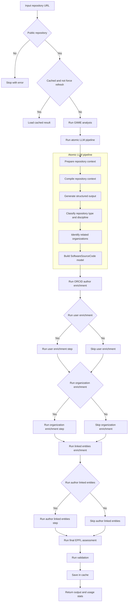

# Repository Analysis Agent Strategy

This document describes the current `Repository.run_analysis()` behavior in `src/analysis/repositories.py`.

## Pipeline flow

## Core stages

1. Cache and repository accessibility checks.
2. GIMIE metadata retrieval.
3. Atomic LLM pipeline for core repository structure.
4. Optional enrichment branches (users, organizations, author-level linked entities).
5. Academic catalog linked entities + final EPFL assessment.
6. Validation and cache persistence.

## Token accounting

The repository analysis aggregates both:

- official API token usage (`input_tokens`, `output_tokens`), and
- estimated token usage (`estimated_input_tokens`, `estimated_output_tokens`).

These values are returned in `APIOutput.stats`.
