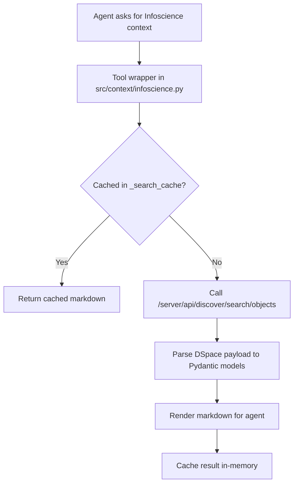

# Infoscience Integration

This project integrates EPFL Infoscience through `src/context/infoscience.py` and uses it from linked-entities and enrichment pipelines.

## Scope in current code

- HTTP client and parsing helpers:
  - `_make_api_request`
  - `_parse_publication`, `_parse_author`, `_parse_lab`
- Search functions:
  - `search_publications`
  - `search_authors`
  - `search_labs`
  - `get_author_publications`
  - `get_entity_by_uuid`
- Agent tool wrappers (markdown output + in-memory dedup cache):
  - `search_infoscience_publications_tool`
  - `search_infoscience_authors_tool`
  - `search_infoscience_labs_tool`
  - `get_author_publications_tool`

## Data models used

- `InfosciencePublication` (`src/data_models/infoscience.py`)
- `InfoscienceAuthor` (`src/data_models/infoscience.py`)
- `InfoscienceOrgUnit` (`src/data_models/infoscience.py`)
- `linkedEntitiesRelation` and `linkedEntitiesEnrichmentResult` (`src/data_models/linked_entities.py`)

## Search strategy

## Query configurations currently used

- Publications: `configuration=researchoutputs`
- Person profiles: `configuration=person` (with publication fallback)
- Organizational units/labs: `configuration=orgunit` (with publication metadata fallback)

## Where Infoscience is consumed

- Repository pipeline (`src/analysis/repositories.py`):
  - `run_linked_entities_enrichment` uses atomic linked-entity search + structuring.
- User pipeline (`src/analysis/user.py`):
  - `run_linked_entities_enrichment` calls `enrich_user_linked_entities`.
- Organization pipeline (`src/analysis/organization.py`):
  - `run_linked_entities_enrichment` calls `enrich_organization_linked_entities`.

## Operational notes

- `INFOSCIENCE_TOKEN` is optional and used when authenticated requests are needed.
- Tool wrappers intentionally cache identical searches during one process lifetime to reduce repeated calls.
- Returned entities are normalized to Infoscience entity URLs when UUIDs are available.
