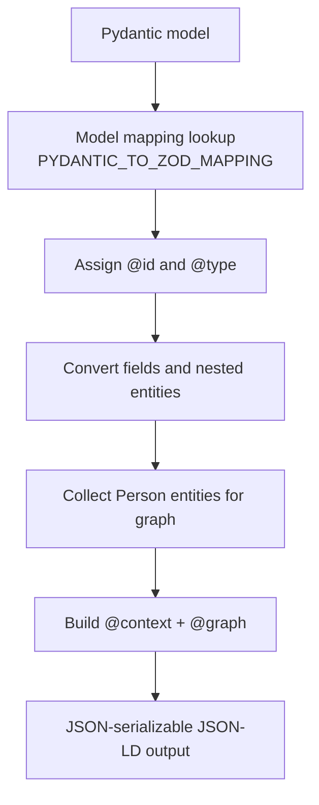

# JSON-LD Conversion Guide

This guide documents the active conversion implementation in `src/data_models/conversion.py`.

## Supported conversion directions

1. Pydantic -> JSON-LD
- Entry: `convert_pydantic_to_jsonld(pydantic_obj, base_url=None)`
- Produces `{"@context": ..., "@graph": [...]}`
- Used by repository API endpoint `/v1/repository/llm/json-ld/{full_path:path}`

2. JSON-LD -> Pydantic
- Entry: `convert_jsonld_to_pydantic(jsonld_graph)`
- Current target: `SoftwareSourceCode` (repository graph)

## Conversion flow

## Context prefixes currently emitted

- `schema`: `http://schema.org/`
- `sd`: `https://w3id.org/okn/o/sd#`
- `pulse`: `https://open-pulse.epfl.ch/ontology#`
- `md4i`: `http://w3id.org/nfdi4ing/metadata4ing#`
- plus RDF/OWL/XSD helper prefixes.

## Notable implementation details

- Person IRI generation priority: explicit `id` -> `githubId` -> `orcid` -> first email.
- `linkedEntities` are preserved and can also contribute DOI-derived `schema:citation` entries.
- Enums and dates are normalized to JSON-compatible values before output.
- `convert_jsonld_to_pydantic` currently expects a `SoftwareSourceCode` entity in graph form.

## API usage

Repository JSON-LD endpoint internally runs:

1. repository analysis (`Repository.run_analysis`)
2. model dump via `repository.dump_results(output_type="json-ld")`
3. JSON-LD sanity checks (`@context` and `@graph` present)

## Troubleshooting

- Missing `@graph`: ensure conversion result is returned directly from `convert_pydantic_to_jsonld`.
- Empty repository on reverse conversion: ensure graph contains `@type` equivalent to `http://schema.org/SoftwareSourceCode`.
- Invalid URL fields: ensure values are valid URL strings before model validation.
