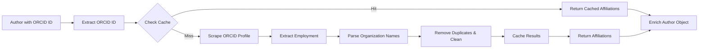

# ORCID Affiliations Feature

## Overview

The ORCID affiliations feature allows you to automatically enrich author metadata with organizational affiliations from ORCID profiles. When authors have an ORCID ID, the system can fetch their employment history and extract only the organization names for inclusion in metadata.

## Features

- ✅ **ORCID ID Parsing**: Extract ORCID IDs from URLs or plain text
- ✅ **Affiliation Extraction**: Fetch organization names from ORCID employment history
- ✅ **Automatic Caching**: ORCID data is cached for 14 days to reduce API calls
- ✅ **Clean Organization Names**: Automatically removes location suffixes (e.g., ": Lausanne")
- ✅ **Duplicate Removal**: Ensures unique affiliations while preserving order
- ✅ **Easy Integration**: Simple utility functions for enriching author objects

## Data Structure

### Input (Author with ORCID ID)

```json
{
  "name": "Cyril Matthey-Doret",
  "orcidId": "https://orcid.org/0000-0002-1126-1535"
}
```

### Output (Enriched Author)

```json
{
  "name": "Cyril Matthey-Doret",
  "orcidId": "https://orcid.org/0000-0002-1126-1535",
  "affiliation": [
    "Swiss Data Science Center",
    "EPFL - École Polytechnique Fédérale de Lausanne"
  ]
}
```

### ORCID Activities (Raw Data)

The system fetches full employment data from ORCID but only extracts organization names:

```json
{
  "orcid_activities": {
    "employment": [
      {
        "organization": "EPFL - École Polytechnique Fédérale de Lausanne: Lausanne",
        "role": null,
        "start_date": null,
        "end_date": null,
        "location": null,
        "duration_years": null
      }
    ]
  }
}
```

The affiliation field will contain only: `["EPFL - École Polytechnique Fédérale de Lausanne"]`

## Usage

### 1. Extract ORCID ID from URL

```python
from src.utils.utils import extract_orcid_id

# From URL
orcid_id = extract_orcid_id("https://orcid.org/0000-0002-1126-1535")
# Returns: "0000-0002-1126-1535"

# From plain ID
orcid_id = extract_orcid_id("0000-0002-1126-1535")
# Returns: "0000-0002-1126-1535"
```

### 2. Get Affiliations from ORCID

```python
from src.utils.utils import get_orcid_affiliations

# Fetch affiliations (uses cache by default)
affiliations = get_orcid_affiliations("0000-0002-1126-1535")
# Returns: ["Swiss Data Science Center", "EPFL - École Polytechnique Fédérale de Lausanne"]

# Force refresh (bypass cache)
affiliations = get_orcid_affiliations("0000-0002-1126-1535", use_cache=False)
```

### 3. Enrich Author Objects

```python
from src.utils.utils import enrich_author_with_orcid

author = {
    "name": "Cyril Matthey-Doret",
    "orcidId": "https://orcid.org/0000-0002-1126-1535"
}

enriched_author = enrich_author_with_orcid(author)
# Returns:
# {
#     "name": "Cyril Matthey-Doret",
#     "orcidId": "https://orcid.org/0000-0002-1126-1535",
#     "affiliation": ["Swiss Data Science Center", ...]
# }
```

### 4. Batch Processing

```python
authors = [
    {
        "name": "Cyril Matthey-Doret",
        "orcidId": "https://orcid.org/0000-0002-1126-1535"
    },
    {
        "name": "Sabine Maennel",
        "orcidId": "https://orcid.org/0009-0001-3022-8239"
    }
]

# Enrich all authors
enriched_authors = [enrich_author_with_orcid(author) for author in authors]
```

## Caching

ORCID affiliations are automatically cached to minimize external API calls:

- **Cache Type**: `orcid`
- **Default TTL**: 14 days
- **Cache Key**: Based on ORCID ID and data type (`affiliations`)
- **Storage**: SQLite database (`api_cache.db`)

### Cache Management

```python
from src.core.cache_manager import get_cache_manager

cache_manager = get_cache_manager()

# Invalidate ORCID cache for a specific ID
cache_manager.invalidate_api_cache(
    api_type="orcid",
    params={"orcid_id": "0000-0002-1126-1535", "data_type": "affiliations"}
)

# Get cache statistics
stats = cache_manager.get_cache_stats()
print(stats)
```

### Cache Configuration

You can configure ORCID cache TTL via environment variables:

```bash
# Set ORCID cache TTL to 30 days
export CACHE_ORCID_TTL_DAYS=30
```

## API Endpoints

If using the REST API, ORCID affiliations are automatically fetched when processing repository metadata:

```bash
# Extract metadata with ORCID affiliations
GET /v1/extract/json/https://github.com/user/repo

# Force refresh ORCID data
GET /v1/extract/json/https://github.com/user/repo?force_refresh=true
```

## Examples

Run the example script to see all features in action:

```bash
python examples/example_orcid_affiliations.py
```

This will demonstrate:
1. Extracting ORCID IDs from URLs
2. Fetching affiliations from ORCID
3. Enriching author objects
4. Cache usage patterns

## Data Flow



## Implementation Details

### Organization Name Cleaning

The system automatically cleans organization names:

1. **Remove Location Suffixes**: `"EPFL: Lausanne"` → `"EPFL"`
2. **Remove Duplicates**: Multiple entries for same org are merged
3. **Preserve Order**: First occurrence is kept

### ORCID Scraping

- Uses Selenium with headless Firefox for dynamic content
- Parses employment section from ORCID profile page
- Extracts organization, role, dates, location (but only returns org names for affiliations)
- Falls back gracefully if ORCID profile is private or unavailable

## Error Handling

The system handles errors gracefully:

- **Invalid ORCID ID**: Returns empty list, logs warning
- **ORCID Profile Not Found**: Returns empty list
- **Network Errors**: Returns empty list, logs error
- **Existing Affiliations**: Does not overwrite existing affiliation data

## Best Practices

1. **Use Caching**: Always use cached data unless you need real-time updates
2. **Batch Processing**: Process multiple authors in batch to benefit from cache
3. **Error Recovery**: Check returned affiliations list before using
4. **Privacy**: Respect ORCID privacy settings (private profiles return no data)

## Limitations

- Only extracts organization names (not roles, dates, or other employment details)
- Requires ORCID profile to be public
- Depends on ORCID website structure (may break if ORCID changes their HTML)
- Rate limited by ORCID (caching helps mitigate this)

## Future Enhancements

Potential improvements:
- Support for ORCID API instead of web scraping
- Include role/position information
- Support for education affiliations
- Configurable affiliation filters
- ORCID ID validation against ORCID API
