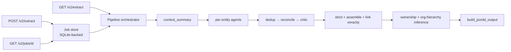

# API and CLI

Quick reference for both the extraction service and the per-index CLIs.
For the full v2 contract see [V2 API Reference](v2-api-reference.md); for
RAG indices see [RAG Indices Overview](https://github.com/sdsc-ordes/open-pulse-sources/blob/main/docs/rag-indices.md).

## Main entrypoints

- API app: `git_metadata_extractor/app.py` — mounts the `/v2/*` router (v1 was removed in 3.0.0).
- V2 router: `git_metadata_extractor/api.py`.
- V2 pipeline driver: `git_metadata_extractor/pipeline/orchestrator.py`.

## Authentication

`/v2/extract` and `/v2/jobs/{id}` require a bearer
token; `/`, `/docs`, and `/v2/health` stay open. Send the token from the
server-side `API_TOKEN` env var:

```http
Authorization: Bearer <API_TOKEN>
```

Missing or wrong token → `401` (with `WWW-Authenticate: Bearer`). Server
without `API_TOKEN` set → `503`. Generate a value with:

```bash
python -c "import secrets; print(secrets.token_urlsafe(32))"
```

Full failure-mode table at
[v2-api-reference.md#authentication](v2-api-reference.md#authentication).

## Active endpoints

### V2 (use these for new clients)

- `GET  /v2/health` — health check + provider preflight.
- `GET  /v2/extract/{full_path:path}` — synchronous extraction. Path is a
  GitHub URL or path (`github.com/owner/name`).
- `POST /v2/extract` — async submission. Returns `202` + `job_id`. Body:
  `{source_url, agent_runtime?, output_format?, include_context_summary?}`.
- `GET  /v2/jobs/{job_id}` — poll for async job status / result.

Common query parameters on `GET /v2/extract`:

- `output_format` — `jsonld` (default) or `json`.
- `agent_runtime` — `rule_based` or `llm` (defaults to
  `V2_AGENT_RUNTIME_DEFAULT`, which itself defaults to `llm`).
- `include_context_summary` — `true|false` (default `false`).

Example requests (export `API_TOKEN` first so the snippets work as-is):

```bash
export API_TOKEN=...   # value from .env

# sync, JSON-LD
curl -s -H "Authorization: Bearer $API_TOKEN" \
  "http://localhost:1234/v2/extract/github.com/octocat/Hello-World?output_format=jsonld" | jq

# sync, JSON, rule-based
curl -s -H "Authorization: Bearer $API_TOKEN" \
  "http://localhost:1234/v2/extract/github.com/octocat/Hello-World?output_format=json&agent_runtime=rule_based" | jq

# async
curl -s -X POST http://localhost:1234/v2/extract \
  -H "Authorization: Bearer $API_TOKEN" \
  -H "Content-Type: application/json" \
  -d '{"source_url": "github.com/octocat/Hello-World", "output_format": "json", "agent_runtime": "llm"}' | jq
# → {"job_id": "...", "status": "pending", "status_url": "/v2/jobs/..."}

# poll
curl -s -H "Authorization: Bearer $API_TOKEN" \
  "http://localhost:1234/v2/jobs/<job_id>" | jq
```

### V1 (removed in 3.0.0)

The `/v1/*` surface returns 404 since 3.0.0 — see
[docs/migration-v1-to-v2.md](migration-v1-to-v2.md) for the endpoint mapping.

## V2 response shape

`GET /v2/extract` and the `result` field of a completed job both return
`V2ExtractResponse`:

- `source_url`
- `detected_type` — `repository | user | organization`
- `output_format` — `jsonld | json`
- `output` — see below
- `warnings` — non-fatal pipeline warnings
- `stats` — run-scoped counts + duration
- optional `context_summary_markdown` (when requested and available)

`output_format=json`:

- `root_entity: object | null`
- `related_entities: list[object]`
- `excluded_entities: list[object]`
- `entities_by_type: {repositories, persons, organizations, articles, memberships, contributions}`

`output_format=jsonld`:

- `@context: object`
- `@graph: list[object]`
- optional `excluded_entities`

## Per-index CLIs (moved)

The per-index CLIs (`python -m open_pulse_sources.index.<name>`), their
`just <prefix>-*` recipes, the federated `gme-search`/`gme-entity` CLI,
and the `/v2/indices/*` management API all live in the
[open-pulse-sources](https://github.com/sdsc-ordes/open-pulse-sources)
repo — see its README and `just --list` there. This service only reads
the resulting stores.

## Smoke tests

```bash
# v2 — health is open
curl -s "http://localhost:1234/v2/health" | jq

# v2 extract requires the bearer token
curl -s -H "Authorization: Bearer $API_TOKEN" \
  "http://localhost:1234/v2/extract/github.com/octocat/Hello-World?output_format=json&agent_runtime=rule_based" | jq
```

## Batch extraction

`scripts/v2/batch_extract.sh` reads a hardcoded URL list and drives
`/v2/extract` with configurable parallelism. Resumable: skips repos whose
result file already exists with a non-`running` status.

## Endpoint-to-pipeline map


