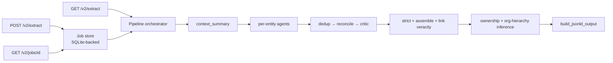

# API and CLI

Quick reference for both the extraction service and the per-index CLIs.
For the full v2 contract see [V2 API Reference](v2-api-reference.md); for
RAG indices see [RAG Indices Overview](https://github.com/caviri/open-pulse-sources/blob/main/docs/rag-indices.md).

## Main entrypoints

- API app: `src/api.py` — mounts `/v1/*` (frozen) and `/v2/*` (active).
- V2 router: `src/v2/api.py`.
- V2 pipeline driver: `src/v2/pipeline/orchestrator.py`.
- V1 analysis (frozen): `src/v1/analysis/`.

## Authentication

All `/v1/*` routes plus `/v2/extract` and `/v2/jobs/{id}` require a bearer
token; `/`, `/docs`, and `/v2/health` stay open. Send the token from the
server-side `API_TOKEN` env var:

```http
Authorization: Bearer <API_TOKEN>
```

Missing or wrong token → `401` (with `WWW-Authenticate: Bearer`). Server
without `API_TOKEN` set → `503`. Generate a value with:

```bash
python -c "import secrets; print(secrets.token_urlsafe(32))"
```

Full failure-mode table at
[v2-api-reference.md#authentication](v2-api-reference.md#authentication).

## Active endpoints

### V2 (use these for new clients)

- `GET  /v2/health` — health check + provider preflight.
- `GET  /v2/extract/{full_path:path}` — synchronous extraction. Path is a
  GitHub URL or path (`github.com/owner/name`).
- `POST /v2/extract` — async submission. Returns `202` + `job_id`. Body:
  `{source_url, agent_runtime?, output_format?, include_context_summary?}`.
- `GET  /v2/jobs/{job_id}` — poll for async job status / result.

Common query parameters on `GET /v2/extract`:

- `output_format` — `jsonld` (default) or `json`.
- `agent_runtime` — `rule_based` or `llm` (defaults to
  `V2_AGENT_RUNTIME_DEFAULT`, which itself defaults to `llm`).
- `include_context_summary` — `true|false` (default `false`).

Example requests (export `API_TOKEN` first so the snippets work as-is):

```bash
export API_TOKEN=...   # value from .env

# sync, JSON-LD
curl -s -H "Authorization: Bearer $API_TOKEN" \
  "http://localhost:1234/v2/extract/github.com/octocat/Hello-World?output_format=jsonld" | jq

# sync, JSON, rule-based
curl -s -H "Authorization: Bearer $API_TOKEN" \
  "http://localhost:1234/v2/extract/github.com/octocat/Hello-World?output_format=json&agent_runtime=rule_based" | jq

# async
curl -s -X POST http://localhost:1234/v2/extract \
  -H "Authorization: Bearer $API_TOKEN" \
  -H "Content-Type: application/json" \
  -d '{"source_url": "github.com/octocat/Hello-World", "output_format": "json", "agent_runtime": "llm"}' | jq
# → {"job_id": "...", "status": "pending", "status_url": "/v2/jobs/..."}

# poll
curl -s -H "Authorization: Bearer $API_TOKEN" \
  "http://localhost:1234/v2/jobs/<job_id>" | jq
```

### V1 (frozen, kept for backwards compatibility)

- `GET  /v1/repository/gimie/json-ld/{full_path:path}` — GIMIE-only JSON-LD.
- `GET  /v1/repository/llm/json/{full_path:path}` — repository pydantic output.
- `GET  /v1/repository/llm/json-ld/{full_path:path}` — repository JSON-LD.
- `GET  /v1/user/llm/json/{full_path:path}` — user profile.
- `GET  /v1/org/llm/json/{full_path:path}` — organization analysis.
- `GET  /v1/cache/stats|entries`, `POST /v1/cache/{cleanup,clear,enable,disable}`,
  `DELETE /v1/cache/invalidate/{api_type}` — v1 cache controls.

V1 query flags:

- `force_refresh=true` — bypass cache.
- `enrich_orgs=true` — run organization enrichment.
- `enrich_users=true` — run user enrichment (repository / user routes).

For mapping V1 calls to V2 see
[Migration: V1 → V2](migration-v1-to-v2.md).

## V2 response shape

`GET /v2/extract` and the `result` field of a completed job both return
`V2ExtractResponse`:

- `source_url`
- `detected_type` — `repository | user | organization`
- `output_format` — `jsonld | json`
- `output` — see below
- `warnings` — non-fatal pipeline warnings
- `stats` — run-scoped counts + duration
- optional `context_summary_markdown` (when requested and available)

`output_format=json`:

- `root_entity: object | null`
- `related_entities: list[object]`
- `excluded_entities: list[object]`
- `entities_by_type: {repositories, persons, organizations, articles, memberships, contributions}`

`output_format=jsonld`:

- `@context: object`
- `@graph: list[object]`
- optional `excluded_entities`

## Per-index CLIs

Every RAG index ships its own CLI (`python -m src.index.<name>`) plus
`just <prefix>-*` recipes. Common shape:

```bash
just <prefix>-status                  # counts + paths
just <prefix>-ingest --scope <scope>  # populate DuckDB
just <prefix>-embed                   # push vectors to Qdrant
just <prefix>-search "<query>"        # semantic retrieval
just <prefix>-query --predefined ...  # SQL over DuckDB
```

Recipes registered in the justfile:

| Index | Prefix | Notes |
|---|---|---|
| HuggingFace | `hf-*` | adds `hf-discover-orgs`, `hf-lineage` |
| OpenAlex | `openalex-*` | adds `openalex-find-github`, `openalex-rebuild-qdrant`, `openalex-serve` |
| ORCID | `orcid-*` | adds `orcid-discover`, `orcid-serve` |
| Zenodo | `zenodo-*` | adds `zenodo-serve` |
| GitHub | `gh-*` | adds `gh-rebuild-qdrant`, `gh-serve` |
| Infoscience | `index-infoscience-*` | full lifecycle + `ingest-duckdb` + `query` |
| ROR | (per-CLI) | `python -m src.index.ror …` |
| ETH Research Collection | (per-CLI) | `python -m src.index.ethz_research_collection …` |
| SNSF | (per-CLI) | `python -m src.index.snsf …` |
| Federated | `gme-*` | `gme-search`, `gme-entity`, `gme-indices` |

## Smoke tests

```bash
# v2 — health is open
curl -s "http://localhost:1234/v2/health" | jq

# v2 extract requires the bearer token
curl -s -H "Authorization: Bearer $API_TOKEN" \
  "http://localhost:1234/v2/extract/github.com/octocat/Hello-World?output_format=json&agent_runtime=rule_based" | jq

# v1 (legacy) — recipes also need API_TOKEN; they pick it up from .env via just
just api-test-gimie
just api-test-extract
just api-test-extract-refresh
```

## Batch extraction

`scripts/v2/batch_extract.sh` reads a hardcoded URL list and drives
`/v2/extract` with configurable parallelism. Resumable: skips repos whose
result file already exists with a non-`running` status.

## Endpoint-to-pipeline map


