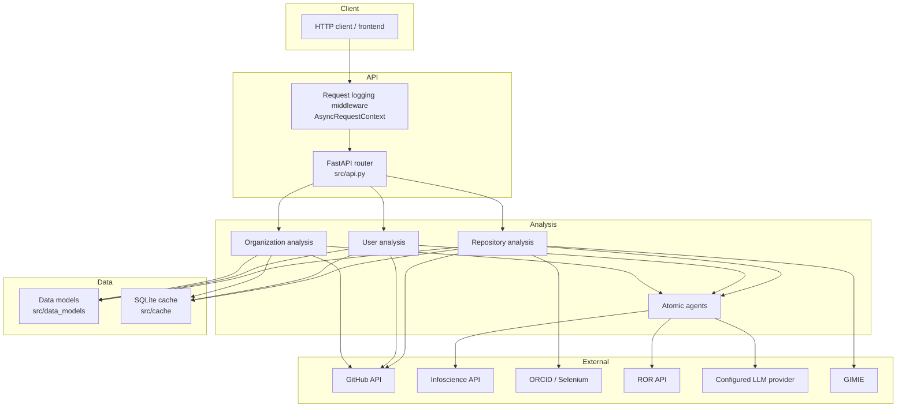
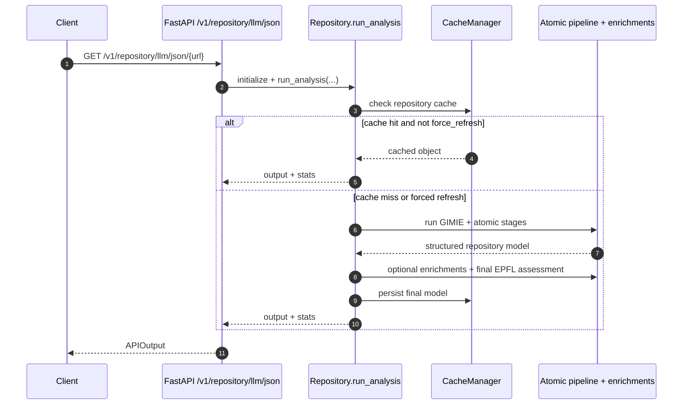

# Design Notes

This page documents the current runtime architecture in `v2.0.0`.

## Component architecture

## Repository request sequence

## Notes

- Cache TTL defaults are configured in `src/cache/cache_config.py` (default 365 days unless overridden).
- Repository pipeline includes optional enrichments (`enrich_orgs`, `enrich_users`) and always runs final validation before caching.
- Organization analysis uses an atomic 6-stage flow; user analysis combines GitHub parsing + LLM + enrichment steps.
