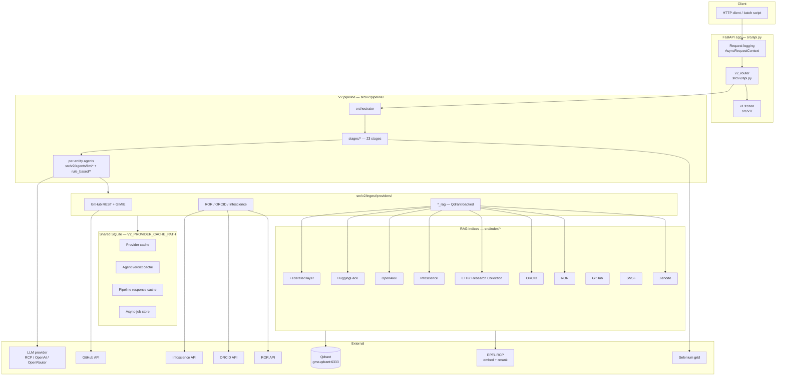
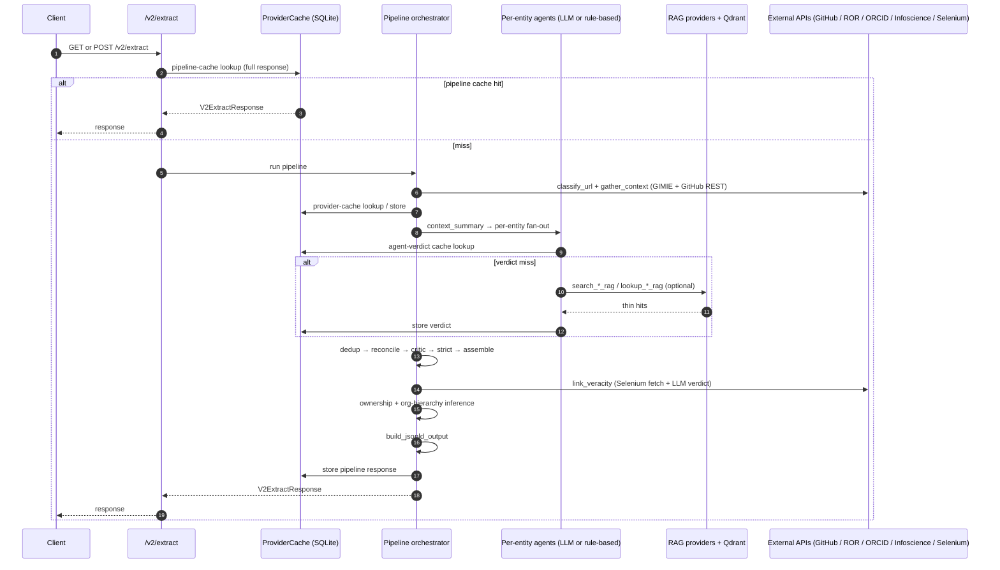
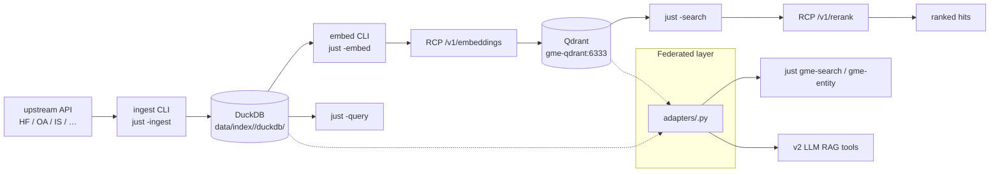

# Design Notes

This page documents the current runtime architecture (`v2.0.0+`).

## Component architecture

## V2 extract sequence

For async submission (`POST /v2/extract`), the API persists a job record
into the same SQLite under the `v2-extract-job` namespace and runs the
pipeline as a background task. Clients poll `GET /v2/jobs/{job_id}`.

## Pipeline cache topology

Three caches share a single SQLite DB (path: `V2_PROVIDER_CACHE_PATH`):

1. **Provider cache** — gimie payloads, GitHub REST responses, ROR /
   ORCID / Infoscience hits. Deterministic, content-addressed.
2. **Agent verdict cache** — LLM agent results keyed on agent name +
   identity. Skips a repeat LLM call for a known-good payload.
3. **Pipeline cache** — full `/v2/extract` response for a given source URL.

The async-job store also lives in this SQLite (separate namespace, same
TTL). Set `V2_PROVIDER_CACHE_PATH` to a different file per run profile
(e.g. `.cache/v2-rule-based/providers.db` for rule-based runs) to keep
them isolated and independently invalidatable.

## RAG index architecture

Each index under `src/index/<name>/` is independent: its own DuckDB, its
own Qdrant collections, its own CLI, its own FastAPI app, its own refresh
cadence. The federated layer (`src/index/_federated/`) never shares
state — it just orchestrates fan-out across registered adapters in a
`ThreadPoolExecutor`.

Shared infrastructure (post-2026-05-01 pattern):

- **Storage**: DuckDB at `data/index/<name>/duckdb/<name>.duckdb` —
  canonical records + `chunks` ledger (one row per Qdrant point).
- **Vector store**: Qdrant — per-index collections, cosine distance,
  4096-dim vectors.
- **Embeddings**: `Qwen/Qwen3-Embedding-8B` on EPFL RCP, instruction-aware.
- **Reranker**: `Qwen/Qwen3-Reranker-8B` on EPFL RCP.
- **Chunking**: token-aware sliding window via `tiktoken` (`cl100k_base`).
- **Auth**: `RCP_TOKEN` (required); per-index source tokens (`HF_TOKEN`,
  `GME_GITHUB_TOKEN`, `INFOSCIENCE_TOKEN`, …) where the upstream API requires
  them.

The `ror` index is a partial outlier (no DuckDB layer; flat catalog of
orgs in Qdrant + a JSONL dump for lexical lookup).

See [RAG Indices Overview](https://github.com/caviri/open-pulse-sources/blob/main/docs/rag-indices.md) for the full inventory and
per-index quickstarts.

## Notes

- The frozen v1 pipeline (`src/v1/`) shares the FastAPI app but has its
  own cache (`src/v1/cache/`) and code paths. No new work targets v1.
- Internal pipeline metadata fields whose names start with `_` are
  stripped before strict validation, JSON-LD output, and any external
  artefact. Never expose `_`-prefixed fields in API responses.
- `identifiers.uuid` on every entity is server-generated
  (`src/v2/agents/models.py::generate_uuid()`); the LLM never controls it.
- See [V2 API Reference](../v2-api-reference.md) for the full 23-stage
  pipeline and gating rules.
