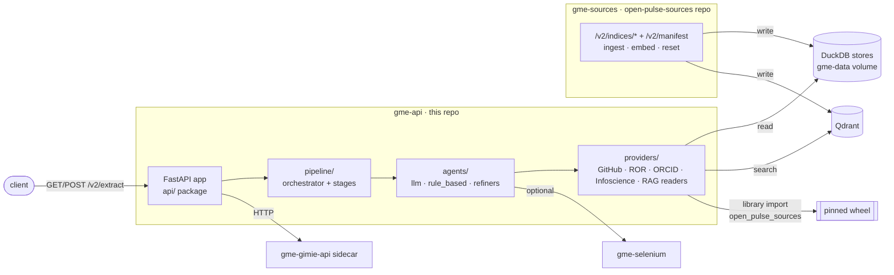
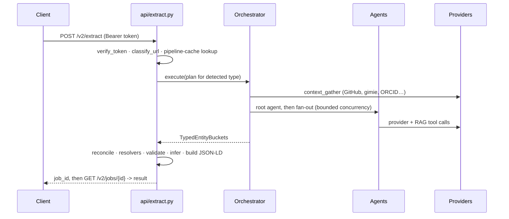

# Architecture Overview

How the service is put together: the layers, what each owns, and the seams
where things go wrong. For the stage-by-stage tour see
[V2 Extract Pipeline](../v2-pipeline.md); for the index-layer split see
[Cross-Repo Contract](../cross-repo-contract.md).

---

## Two services, one data volume

Since `3.0.0` the system is two deployables. The split is by **read vs write**,
not by domain:



The consequence worth internalising: **this service reads index state that
another service writes, over a shared volume.** DuckDB's file lock is
per-process and the locks in either service are process-local, so nothing
enforces a single writer across the two. Keep heavy ingest on `gme-sources`.
That gap is tracked as task 05 in `dev/split-rag-indices/`.

---

## Layers

```
git_metadata_extractor/
  app.py              FastAPI app: mounts the /v2 router, /docs UI, startup bootstrap
  api/                the HTTP surface (URL prefix /v2 — the public contract)
    _router.py        the single APIRouter
    _helpers.py       env gates, stage constants, app-state resolution
    extract.py        GET/POST /extract, _run_extract_job, post-agent sequencing
    auto_ingest.py    post-extract index write-through (opt-in, off by default)
    jobs.py           /jobs/{id}, cancel, /crawl
    system.py         /cache/clear, /health
  jobs.py             async job store backing POST /v2/extract
  config.py           config knobs
  dependencies.py     provider wiring, cache resolver
  log_context.py      request-id logging context
  observation/        per-request external-query log

  pipeline/
    orchestrator.py   agent plans (PLAN_BY_TYPE), fan-out concurrency, retries
    stages/           one module per stage

  agents/
    models.py         AgentResult, ProviderSet, TypedEntityBuckets
    registry.py       runtime -> runner table
    llm/<kind>/       per-entity LLM agents (one Pydantic AI run each)
    llm/agent_tools/  tool factories (selenium, ROR, ORCID, *_rag.py per index)
    rule_based/       deterministic counterparts, no LLM
    refiners/         hybrid-runtime patchers over rule-based output

  providers/          the READ layer: GitHub, ROR, ORCID, Infoscience, gimie,
                      *_rag.py Qdrant-backed readers, cache.py (SQLite/WAL)
  schema/             JSON Schemas (agent + strict), JSON-LD context, models
  validation/         strict-schema + SHACL validators
  canonicalization/   ID resolution, string normalisation
  experimental/       NOT production — the pi terminal-agent PoC
```

Two conventions that are easy to trip over:

- **`api/` is a package, not a module.** It was a single 2,500-line `api.py`
  until `3.0.0`. Docs or notes referring to `src/v2/api.py` predate the split.
- **`experimental/` is quarantined on purpose.** Nothing in it is wired into
  the request path; treat it as a sketchpad.

---

## Request lifecycle



`POST /v2/extract` is asynchronous: it returns `{job_id, status, status_url}`
and you poll `GET /v2/jobs/{job_id}`. `GET /v2/extract/{path}` is the
synchronous single-repo variant. Both are behind
`Authorization: Bearer <API_TOKEN>`, which **fails closed** — a missing
`API_TOKEN` yields 503 with no dev bypass. `/`, `/docs`, and `/v2/health`
stay open.

---

## The three runtimes

`agent_runtime` selects agent implementations; the post-agent sequence is the
same in all three.

| Runtime | Generators | LLM stages | Use it for |
|---|---|---|---|
| `rule_based` | deterministic agents | **none** — guaranteed LLM-free, `link_veracity` always skipped | reproducible runs, tests, batch |
| `llm` | LLM agents (one Pydantic AI run per entity) | `context_summary`, `llm_dedup`, `llm_critic` (gated), `link_veracity`, `org_relationships`, `resolve_bio_to_ror_llm` | best coverage |
| `hybrid` | rule-based generators **+** `refine_with_llm` | only the refiner — dedup/critic/veracity/org-relationships are skipped | cheap targeted improvement |

The hybrid refiner patches a **whitelist** only: organization
`pulse:OrganizationType`; repository `pulse:discipline` and
`pulse:repositoryType` (the latter only when it is currently `pulse:Other`);
person `schema:name` (only when it looks like a GitHub handle). Anything
outside that list is ignored by design — the refiner cannot invent entities.

---

## Hallucination guards

The LLM is never trusted with identity or counts. These run post-LLM, in code:

| Guard | Effect |
|---|---|
| `force_server_uuid` | overwrites the model's UUID with a server-generated one, in `identifiers.uuid` only |
| Repository agent | stars/forks come from GitHub REST, not the model; discipline falls back to `wd:Q428691` when empty |
| Contribution agent | `schema:author` and `pulse:contributionTo` are stamped from the orchestrator's authoritative pair, whatever the model emitted |
| Article agent | drops the entity when `schema:identifier` is a placeholder DOI (`10.0000/…`) or a sentinel (`UNKNOWN`, `N/A`, `TBD`) with no Infoscience id |
| Membership agents | swap `time:hasBeginning` / `hasEnd` when ORCID returns them inverted |

Related: the orchestrator filters fan-out work items whose GitHub handle
resolves to the wrong account type (an Organization queued as a person, or
vice versa), and materialises a User-account repo owner as a Person when it is
missing from `contributors` — otherwise the owner leaks as a bare-string
reference with no backing entity.

---

## Caches

Three logical caches share one SQLite file (`V2_PROVIDER_CACHE_PATH`,
default `.cache/v2/providers.db`, WAL mode):

1. **Provider cache** — gimie payloads, GitHub REST, ROR / ORCID / Infoscience
   hits. Content-addressed and deterministic.
2. **Agent verdict cache** — LLM results keyed on agent name + identity, so a
   repeat run skips the model call.
3. **Pipeline cache** — the whole `/v2/extract` response for a source URL.

Use a **different path per run profile** (LLM vs rule-based) so the two stay
independently invalidatable. TTL is `V2_PROVIDER_CACHE_TTL_DAYS` (30).

---

## Internal fields

Any key starting with `_` (`_person_ref`, `_company`, `_concepts`, …) is
internal pipeline metadata. It is stripped before strict validation, JSON-LD
output, RDF serialisation, and every external artefact — by two independent
layers, deliberately. Opt in with `?include_internal_fields=true`, which also
registers the `gme-internal:` and `publiccode:` namespaces in the `@context`;
default output stays strictly ontology-conformant.

---

## Identifier conventions

| Entity | `@id` |
|---|---|
| Person | `https://orcid.org/{orcid}` → `https://github.com/{login}` → `urn:pulse:{uuid}` |
| Organization | `https://ror.org/{id}` → `https://github.com/{handle}` → `urn:pulse:{uuid}` |
| Repository | `https://github.com/{owner}/{name}` |
| Article | `https://doi.org/{doi}` |
| Membership | `{person_id}__{org_id}` composite |
| Contribution | `{person_id}__{repo_id}` composite |

Arrows mean "first non-null wins". `identifiers.uuid` is always
server-generated; the LLM never controls it.
