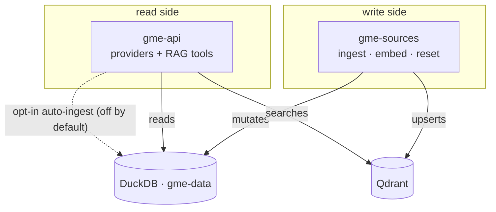

# Cross-Repo Contract

Since `3.0.0` the RAG index layer lives in
[open-pulse-sources](https://github.com/sdsc-ordes/open-pulse-sources). This
page is the contract between the two repos: which side owns what, how versions
are pinned, and the sharp edges of a shared data volume.

---

## Who owns what

| | `git-metadata-extractor` (this repo) | `open-pulse-sources` |
|---|---|---|
| Role | extraction service — **reads** indices | index layer — **writes** indices |
| HTTP surface | `/v2/extract`, `/v2/jobs/*`, `/v2/health` | `/v2/manifest`, `/v2/indices/*` (ingest, embed, reset, stats) |
| Deployable | `gme-api` | `gme-sources` |
| Code | `providers/*_rag.py` readers, agent RAG tools | ingest pipelines, embedding, DuckDB stores, federated search |
| Ops | extraction runbook | ingest/embed recipes, seeds, migration scripts |

Consumed **twice**, which is the thing to keep straight:

1. As a **library** — `import open_pulse_sources`, used by the read-side
   providers, `canonicalization/doi.py`, and the gunicorn startup bootstrap.
   Imported unconditionally, so it is a hard dependency, not an extra.
2. As a **service image** — the `gme-sources` container that owns the write
   side.

Both must be the same release. They share DuckDB stores and Qdrant
collections, so a version skew shows up as empty search results or a failed
bootstrap rather than a clean error.

Not moved: `config/index/*.yaml` stays in this repo, because the library
resolves config and data paths relative to the working directory.

---

## Version pinning

The library version lives in **exactly one place** — the
`open-pulse-sources @ git+…@<tag>` entry in `pyproject.toml` `dependencies`.
Every install path inherits it: `just install`, `just install-dev`, CI, and
`tools/image/Dockerfile`.

| Supported pair | Library | `gme-sources` image |
|---|---|---|
| `3.0.0` | `v0.1.2` | `ghcr.io/sdsc-ordes/open-pulse-sources:0.1.2` |

`v0.1.1` and earlier are **not** supported by `3.0.0`: they answer a missing
credential with a raw 500 instead of a 503.

### Rules

- **Never add a second pin.** No extra
  `pip install "open-pulse-sources @ git+…@<tag>"` anywhere.
  `tests/v2/test_open_pulse_sources_pin.py` fails on a hardcoded second pin.
- **Pins must be immutable** — a release tag (`vX.Y.Z`) or a full commit SHA.
  A `main` or `latest` default fails the same test.
- **The compose image tag must match the library pin.** Also enforced by that
  test.
- **`OPEN_PULSE_SOURCES_REF`** (Docker build arg) defaults to *empty* and is an
  override-only escape hatch for testing an unreleased child revision. A
  permanent bump belongs in `pyproject.toml`.

### Bumping the child version

1. Edit the pin in `pyproject.toml`.
2. Match the `gme-sources` image tag in `tools/deploy/docker-compose.yml`.
3. Add a row to the table above (and to the README matrix).
4. `pytest tests/v2/test_open_pulse_sources_pin.py`.

Published images record the resolved ref as the
`ch.sdsc.pulse.open-pulse-sources-ref` OCI label, so a deployment smoke test
can compare `gme-api`'s library revision against the running `gme-sources`
image without rebuilding anything.

### Local cross-repo development

`just install-dev` re-installs a checkout found at `./open-pulse-sources` **or**
`../open-pulse-sources` as editable, overriding the pin, and echoes which path
it took. Without a checkout it uses the pinned release.

---

## Shared state, and the writer problem

`gme-api` and `gme-sources` share the `gme-data` volume (DuckDB stores) and a
Qdrant instance.

**DuckDB's file lock is per-process, and both services' locks are
process-local.** Nothing enforces a single writer across services. Practical
rules:

- Keep bulk ingest / embed / reset on `gme-sources`.
- Leave extract-side auto-ingest **off** (the default) unless you know no
  ingest is running; it is the one path where `gme-api` writes.
- The child publishes atomic read-only snapshots (`.ro.duckdb`), which is the
  correct isolation mechanism — but two read paths in this repo still open the
  live files, so a read during a write can observe partial state. Tracked as
  task 06.

An architectural fix (making `gme-sources` the only writer, with this service
posting jobs to it) is task 05 in `dev/split-rag-indices/`.

---

## Required deployment settings

`INDEX_DATA_DIR` must be set explicitly on **both** services
(`/app/data/index` in the shipped compose file). Without it, a wheel-installed
library resolves its data root relative to the package — i.e.
`site-packages/data` — and every store fails to bootstrap with a permission
error. `INDEX_QDRANT_URL` points at Qdrant (`http://gme-qdrant:6333` in
compose).

---

## Read-side feature flags

Each RAG index has an on/off switch, all defaulting to `true`, and each
degrades gracefully when Qdrant or the credential is unavailable:
`V2_INFOSCIENCE_RAG_ENABLED`, `V2_ETHZ_RESEARCH_COLLECTION_RAG_ENABLED`,
`V2_HUGGINGFACE_RAG_ENABLED`, `V2_OPENALEX_RAG_ENABLED`,
`V2_ZENODO_RAG_ENABLED`, `V2_ORCID_RAG_ENABLED`, `V2_ROR_RAG_ENABLED`,
`V2_SWISSUBASE_RAG_ENABLED`, `V2_RENKULAB_RAG_ENABLED`,
`V2_EPFL_GRAPH_RAG_ENABLED`.

"Degrades gracefully" means the provider disables itself and the pipeline runs
without it. That is convenient in development and dangerous in production — it
is exactly how a dead HuggingFace provider went unnoticed for weeks. The
import-contract test (`tests/v2/test_open_pulse_sources_contract.py`) exists
because of that incident: it walks every `open_pulse_sources` reference in the
package with AST and fails if any cannot be resolved against the installed
library.

See [V2 Agent RAG Tools](v2-rag-tools.md) for what each index provides to the
agents.
