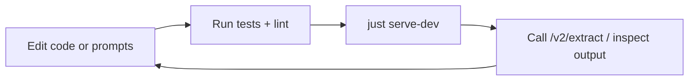

# Getting Started

## 1. Install dependencies

This project uses [`uv`](https://docs.astral.sh/uv/) for dependency management.

```bash
just install-dev          # uv pip install -e ".[dev]"
```

## 2. Configure environment

Create `.env` from the template and edit:

```bash
cp .env.example .env
```

Required to serve `/v2/extract`:

- `GME_GITHUB_TOKEN` — `/v2/health` flips to `degraded` without it.
- `API_TOKEN` — bearer token guarding every `/v1/*` route plus
  `/v2/extract` and `/v2/jobs/{id}`. **Fails closed**: missing →
  every protected request returns `503` (no dev bypass). Generate with
  `python -c "import secrets; print(secrets.token_urlsafe(32))"`. See
  [Authentication](v2-api-reference.md#authentication).
- One LLM credential (validated at startup against the active model
  profile in `src/v2/agents/llm/model_config.py`):
  - `RCP_TOKEN` (EPFL RCP), or
  - `OPENAI_API_KEY`, or
  - `OPENROUTER_API_KEY`.

Optional integrations:

- `INFOSCIENCE_TOKEN` — protected Infoscience routes only.
- `SELENIUM_REMOTE_URL` — enables the link-veracity pipeline stage and
  the `fetch_link_content_via_selenium` LLM tool.

Per-indexer politeness (only needed when running the corresponding
indexer):

- `HF_TOKEN` — HuggingFace Hub. Anonymous IPs share a 500-req / 5-min
  bucket; authenticated raises that to 1k API + 5k resolver requests.
  Required in practice for the Switzerland sweep.
- `ZENODO_TOKEN` — raises page size from 25 to 100.
- `OPENALEX_MAILTO` — moves you to the OpenAlex polite pool.
- `EPFL_GRAPH_USERNAME` / `EPFL_GRAPH_PASSWORD` — EPFL Graph API.

V2 pipeline knobs (most-touched; full list in [README.md](https://github.com/Imaging-Plaza/git-metadata-extractor/blob/main/README.md)
and `.env.example`):

- `V2_AGENT_RUNTIME_DEFAULT` (default `llm`) — runtime selector when the
  query omits `agent_runtime`.
- `V2_USE_MOCK_PROVIDERS` (default `true`) — set `false` to hit real APIs.
- `V2_LINK_VERACITY_ENABLED` (default `true`) — turn off in batch runs.
- `V2_APPLY_CRITIC_PRUNING` (default `false`) — enable critic drop suggestions.
- `V2_PROVIDER_CACHE_PATH` (default `.cache/v2/providers.db`) — use a
  separate path per run profile (LLM vs. rule-based) for isolation.
- `V2_<INDEX>_RAG_ENABLED` (default `true`) — toggle RAG tools per index
  (`INFOSCIENCE`, `ETHZ_RESEARCH_COLLECTION`, `HUGGINGFACE`, `OPENALEX`,
  `ZENODO`, `ORCID`, `ROR`).
- `INDEX_QDRANT_URL` — Qdrant endpoint. **Inside the devcontainer use
  `http://gme-qdrant:6333`**, not `localhost:6333`.
- `GIMIE_API_URL` — **required for repository extraction.** GIMIE runs as the
  `gme-gimie-api` sidecar (the `gimie` package was removed from the image); the
  devcontainer compose sets this to `http://gme-gimie-api:15400` for you. Outside
  the devcontainer, either point it at a running sidecar or `pip install
  gimie==0.7.2` for in-process extraction. See
  [operations runbook §8](OPERATIONS_RUNBOOK.md#8-gimie-now-runs-as-a-sidecar-gimie_api_url-is-required).

## 3. Run the API locally

```bash
just serve-dev            # uvicorn + auto-reload on src/**/*.py
```

Default port is `1234`. Override with `HOST=0.0.0.0 PORT=8080 just serve-dev`.

- Swagger UI: <http://localhost:1234/docs>
- v2 health: <http://localhost:1234/v2/health>
- Stop the server: `just serve-stop`

Smoke-test extraction (export `API_TOKEN` first so the snippets work as-is):

```bash
export API_TOKEN=...   # value from .env

# sync, JSON-LD
curl -s -H "Authorization: Bearer $API_TOKEN" \
  "http://localhost:1234/v2/extract/github.com/octocat/Hello-World?output_format=jsonld" | jq

# sync, JSON, rule-based runtime
curl -s -H "Authorization: Bearer $API_TOKEN" \
  "http://localhost:1234/v2/extract/github.com/octocat/Hello-World?output_format=json&agent_runtime=rule_based" | jq

# async (returns 202 + job_id; poll /v2/jobs/{id})
curl -s -X POST "http://localhost:1234/v2/extract" \
  -H "Authorization: Bearer $API_TOKEN" \
  -H "Content-Type: application/json" \
  -d '{"source_url": "github.com/octocat/Hello-World", "output_format": "json"}' | jq

# health check (no auth needed)
curl -s "http://localhost:1234/v2/health" | jq
```

## 4. Run tests and checks

The `justfile` recipes invoke `.venv/bin/python -m pytest` directly; you
do not need to set `PYTHONPATH` or rely on a global `pytest`.

```bash
just test                # fast loop via testmon
just test-full           # full deterministic run (parallelized)
just test-coverage       # with coverage
just lint                # ruff
just type-check          # mypy
just check               # lint + type-check
just ci                  # lint + type-check + coverage
```

Per-index test suites:

```bash
just hf-test
just openalex-test
just orcid-test
```

Opt-in real-provider tests (require credentials and live network):

```bash
just test-llm-integration
just test-live
```

If testmon selection looks stale: `rm -f .testmondata` then `just test-full`.

## 5. Try the RAG indices

Each index is independent; common shape:

```bash
# HuggingFace
just hf-status
just hf-ingest --scope switzerland     # idempotent — skips already-ingested
just hf-embed                           # only embeds new chunks
just hf-search "swiss german LLM" --top-k 5
just hf-lineage epfl-llm/meditron-7b    # walk base_models DAG

# Federated (cross-index)
just gme-indices                                 # list registered adapters
just gme-search "Swiss German LLM" --top-k 10
just gme-entity 0000-0001-9534-3870              # by ORCID, ROR, DOI, HF slug, …
```

See [RAG Indices Overview](https://github.com/caviri/open-pulse-sources/blob/main/docs/rag-indices.md) for the full per-index
inventory, scopes, and storage layout.

## 6. Build and preview docs

```bash
uv pip install -e ".[docs]"
just docs-serve          # local preview
just docs-build          # strict build
```

Publish (CI handles `main` and tag pushes; manual commands available):

```bash
just docs-deploy-dev                  # publish dev + latest
just docs-deploy-release 2.0.1        # publish release + update stable
just docs-set-default stable
```

## Local workflow



## CLI status

- The primary production interface is the FastAPI service (`src/api.py`).
- For batch extractions: `scripts/v2/batch_extract.sh` reads a hardcoded
  URL list and drives `/v2/extract` with configurable parallelism
  (resumable — skips already-completed result files).
- Each RAG index ships its own CLI (`python -m src.index.<name>`) wired
  up via `just <prefix>-*` recipes.
