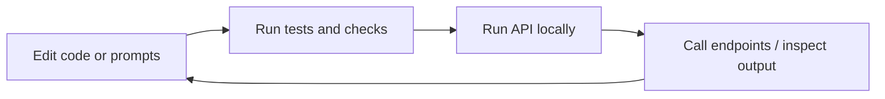

# Getting Started

## 1. Install dependencies

```bash
just install-dev
```

## 2. Configure environment

Create `.env` from `.env.dist` (or update your existing `.env`) and set the required variables:

- `OPENAI_API_KEY`
- `OPENROUTER_API_KEY`
- `GITHUB_TOKEN`
- `GITLAB_TOKEN`
- `INFOSCIENCE_TOKEN`
- `MODEL`
- `PROVIDER`
- `SELENIUM_REMOTE_URL`
- `CACHE_DB_PATH`
- `MAX_SELENIUM_SESSIONS`
- `MAX_CACHE_ENTRIES`
- `GUNICORN_CMD_ARGS`

Commonly used additional variable:

- `RCP_TOKEN` (used by the configured `openai-compatible` endpoint in `src/llm/model_config.py`)

## 3. Run the API locally

```bash
just serve-dev
```

Swagger UI:

- `http://localhost:1234/docs`

## 4. Run tests and checks

```bash
just test
just lint
just type-check
```

Or all checks together:

```bash
just ci
```

## 5. Build and preview docs

```bash
uv pip install -e ".[docs]"
just docs-build
just docs-serve
```

## Local workflow



## CLI status

- The primary production interface is the FastAPI service (`src/api.py`).
- `src/main.py` currently references legacy imports (`core.*`) and does not run as-is in the current v2 layout.
- For conversion workflows, use `scripts/convert_json_jsonld.py`.
