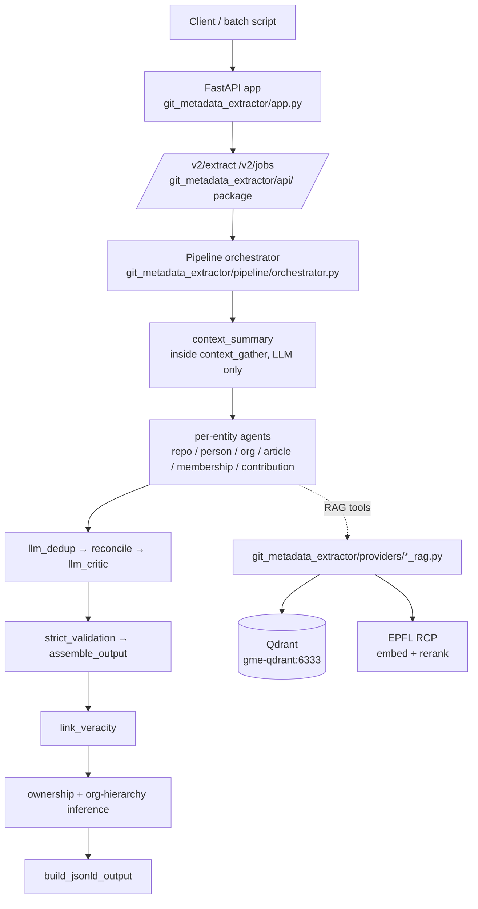
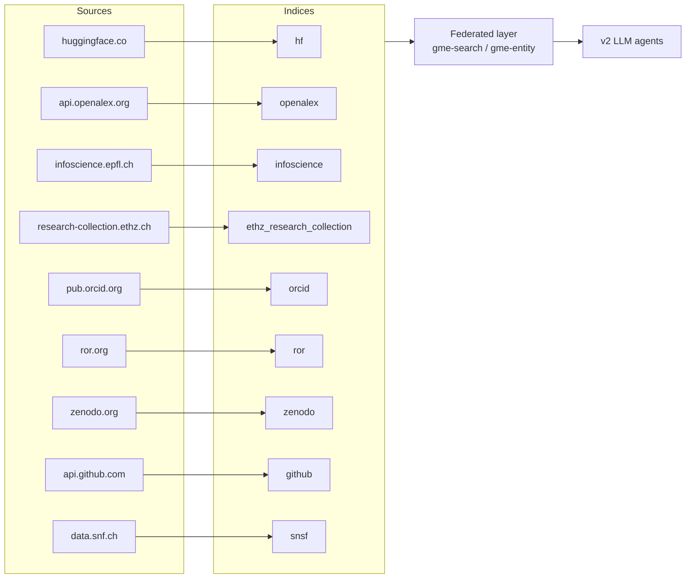

# Git Metadata Extractor

A FastAPI service that turns a GitHub URL (repository / user / org) into
JSON-LD aligned with **Open Pulse Ontology v2.1.2**, plus nine sibling RAG
indices over EPFL/Swiss research catalogues that the v2 LLM agents can
query during extraction.

The system is **two cooperating services in two repositories**:

1. **Extraction service** (this repo: `git_metadata_extractor/`) — the
   FastAPI app serving `/v2/extract` (the legacy v1 API was removed in 3.0.0).
2. **RAG indices** —
   [open-pulse-sources](https://github.com/sdsc-ordes/open-pulse-sources):
   independent Qdrant + DuckDB indices over HuggingFace, OpenAlex,
   Infoscience, ETH Research Collection, ORCID, ROR, Zenodo, GitHub, SNSF
   and more, plus a federated layer and the `/v2/indices/*` management
   API. This service imports its read side as the `open_pulse_sources`
   library and shares the Qdrant/DuckDB stores with it.

## Documentation map

**Start here**

| Doc | What's in it |
|---|---|
| [Getting Started](getting-started.md) | install, first run, common commands |
| [Architecture Overview](architecture/overview.md) | the layers, request lifecycle, runtimes, caches, guards |
| [V2 Extract Pipeline](v2-pipeline.md) | every stage, the load-bearing assumptions, env gates |
| [Cross-Repo Contract](cross-repo-contract.md) | the index-layer split, version pinning, shared-state rules |

**Using the API**

| Doc | What's in it |
|---|---|
| [V2 API Reference](v2-api-reference.md) | `/v2/extract`, `/v2/jobs`, auth, rate limits |
| [API and CLI](api-and-cli.md) | quick reference |
| [Repository Enrichment Fields](repository-enrichment-fields.md) | what lands on the root repository entity |
| [Migration: V1 → V2](migration-v1-to-v2.md) | endpoint mapping for the removed v1 API |

**Deeper**

| Doc | What's in it |
|---|---|
| [Operations Runbook](OPERATIONS_RUNBOOK.md) | running it in anger |
| [V2 Agent RAG Tools](v2-rag-tools.md) | agent-side tools wired into the pipeline |
| [Concept Tagging Stage](concept-tagging.md) | the opt-in discipline/keyword stage |
| [Design Notes](architecture/design-notes.md) | runtime design decisions |
| [Roadmap](ROADMAP.md) | what's left to build |
| [Archive](archive/index.md) | historical working notes — not current documentation |

**In the [open-pulse-sources](https://github.com/sdsc-ordes/open-pulse-sources) repo** (the index layer)

- [RAG Indices Overview](https://github.com/sdsc-ordes/open-pulse-sources/blob/main/docs/rag-indices.md) — the indices + federated layer
- [Federated Search](https://github.com/sdsc-ordes/open-pulse-sources/blob/main/docs/federated-search.md) — cross-index design
- [HuggingFace Index](https://github.com/sdsc-ordes/open-pulse-sources/blob/main/docs/huggingface-index.md) — most-used index, deep-dive

## V2 pipeline at a glance

`/v2/extract` runs the same post-agent sequence regardless of `agent_runtime`.
The runtime selects which agent implementations execute (LLM vs. deterministic
rule-based) and gates the LLM-only stages. Agent generation itself follows a
per-input-type plan — repository, user and organization each get a different
one. Full inventory: [V2 Extract Pipeline](v2-pipeline.md).

LLM agents call **per-index RAG tools** plus a **federated tool**
(`search_federated_rag`, `lookup_entity_federated`) that fans out across
nine indices in parallel. See
[V2 Agent RAG Tools](v2-rag-tools.md) for the full inventory.

## RAG indices at a glance

## Versioning

- `dev` and `latest` track the `main` branch documentation.
- Tagged releases publish immutable doc versions.
- `stable` points to the newest released docs.
