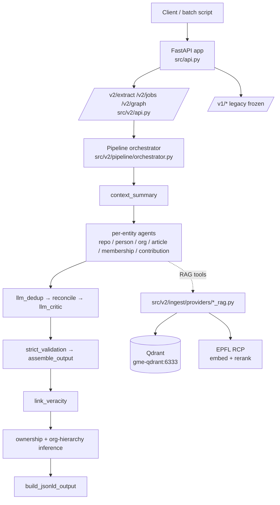
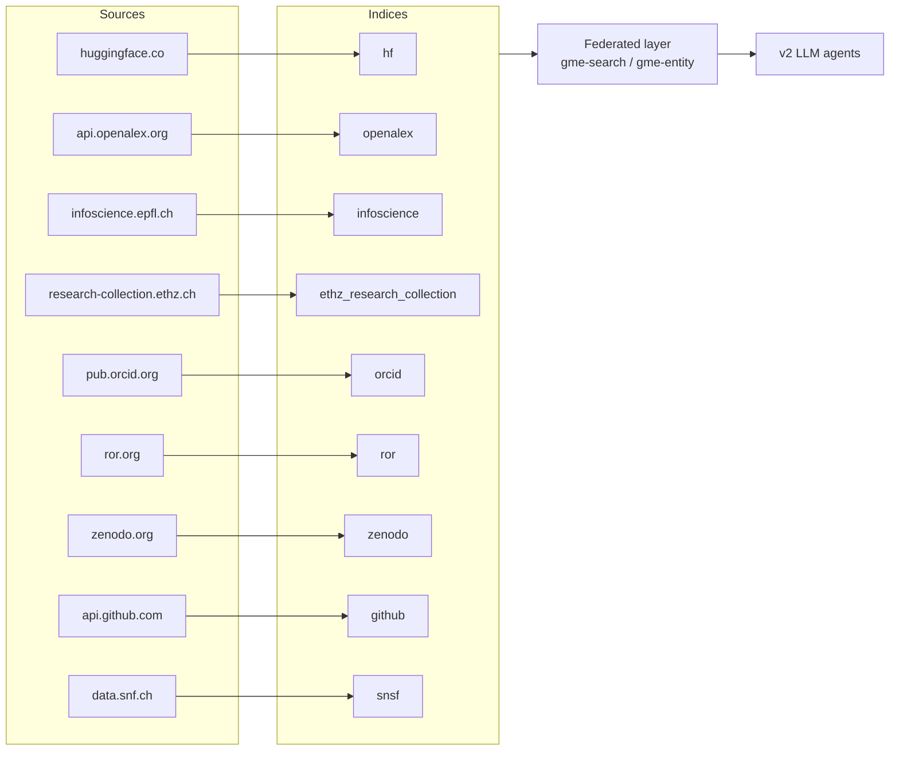

# Git Metadata Extractor

A FastAPI service that turns a GitHub URL (repository / user / org) into
JSON-LD aligned with **Open Pulse Ontology v2.1.2**, plus nine sibling RAG
indices over EPFL/Swiss research catalogues that the v2 LLM agents can
query during extraction.

The repository ships **two cooperating subsystems**:

1. **Extraction service** (`src/v1/`, `src/v2/`) — the FastAPI app. V1 is
   frozen; all new work targets V2 under `src/v2/`.
2. **RAG indices** (`src/index/*`) — independent Qdrant + DuckDB indices
   over HuggingFace, OpenAlex, Infoscience, ETH Research Collection,
   ORCID, ROR, Zenodo, GitHub, SNSF, plus a federated layer that fans out
   across all of them.

## Documentation map

- [Getting Started](getting-started.md) — install, first run, common commands
- [V2 API Reference](v2-api-reference.md) — `/v2/extract`, `/v2/jobs`, `/v2/graph`
- [Migration: V1 → V2](migration-v1-to-v2.md) — endpoint mapping
- [API and CLI](api-and-cli.md) — quick reference
- [RAG Indices Overview](https://github.com/caviri/open-pulse-sources/blob/main/docs/rag-indices.md) — the nine indices + federated layer
- [Federated Search](https://github.com/caviri/open-pulse-sources/blob/main/docs/federated-search.md) — cross-index design
- [HuggingFace Index](https://github.com/caviri/open-pulse-sources/blob/main/docs/huggingface-index.md) — most-used index, deep-dive
- [V2 Agent RAG Tools](v2-rag-tools.md) — agent-side tools wired into the v2 pipeline
- [Roadmap](ROADMAP.md) — what's left to build
- [Design Notes](architecture/design-notes.md) — runtime architecture
- [Legacy Releases](releases/legacy-releases.md)

## V2 pipeline at a glance

`/v2/extract` runs the same 23-stage pipeline regardless of `agent_runtime`.
The runtime only controls which agent implementations execute (LLM vs.
deterministic rule-based). Other stages run unconditionally.

LLM agents call **per-index RAG tools** plus a **federated tool**
(`search_federated_rag`, `lookup_entity_federated`) that fans out across
nine indices in parallel. See
[V2 Agent RAG Tools](v2-rag-tools.md) for the full inventory.

## RAG indices at a glance

## Versioning

- `dev` and `latest` track the `main` branch documentation.
- Tagged releases publish immutable doc versions.
- `stable` points to the newest released docs.
