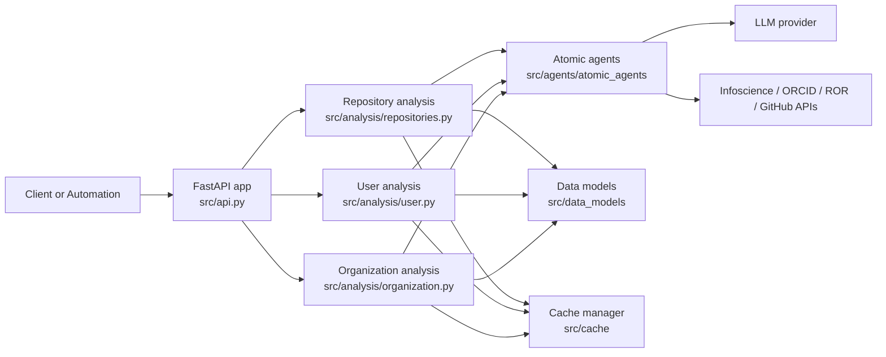

# Git Metadata Extractor Documentation

Git Metadata Extractor analyzes Git repositories, GitHub users, and GitHub organizations, then enriches the output with LLM-based classification and academic catalog context.

## Documentation map

- [Getting Started](getting-started.md)
- [API and CLI](api-and-cli.md)
- [Design Notes](architecture/design-notes.md)
- [Repository Analysis Strategy](AGENT_STRATEGY.md)
- [Legacy Releases](releases/legacy-releases.md)

## System overview

## Versioning

- `dev` and `latest` track the `main` branch documentation.
- Tagged releases publish immutable doc versions.
- `stable` points to the newest released docs.
