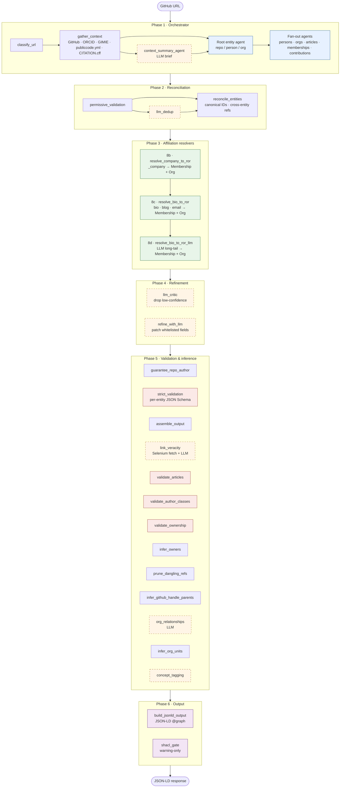
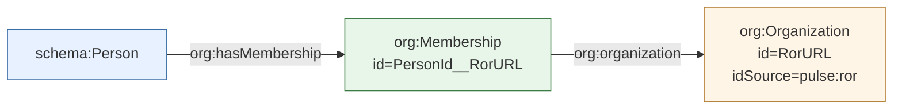

# V2 Extract Pipeline — Overview

The v2 pipeline turns a GitHub URL into a JSON-LD graph aligned with [Open Pulse Ontology v2.1.2](https://open-pulse.epfl.ch/ontology). This doc is the operator-facing tour: what each stage does, what assumptions hold across the pipeline, and where to dig deeper.

**Related:** [Architecture Overview](architecture/overview.md) for how the layers fit together · [Cross-Repo Contract](cross-repo-contract.md) for the index-layer split.

> **Two sequencers, not one.** Agent generation runs from a per-input-type
> plan in the orchestrator (`PLAN_BY_TYPE`); everything after the agents is a
> flat sequence in `api/extract.py`. The stage inventory below reflects both —
> see [Stage inventory](#stage-inventory).

---

## 30-second mental model

Legend: solid blue = agent, green = affiliation resolver, dashed orange = LLM-gated, red = validation, purple = output.

The diagram is deliberately simplified. `classify_url` runs in the API layer *before* the orchestrator, and Phase 5 collapses a dozen inference/validation passes into one box — the full list is below.

---

## Stage inventory

Reconstructed from `PLAN_BY_TYPE`, the `# === <name> stage ===` banners in `api/extract.py` and the `STAGE_*` constants in `api/_helpers.py` (2026-07-29). When in doubt, those three are the source of truth.

### Phase 1 — agent generation (orchestrator)

The plan **varies by what the URL points at**. `ROOT_STAGE_BY_DETECTED_TYPE` picks the root agent; the rest fan out.

| Detected type | Root agent | Then, in order |
|---|---|---|
| `repository` | `repo_agent` | `person_agents` → `org_agents` → `article_agents` → `membership_agents` → `contribution_agents` |
| `user` | `person_agent` | `repo_agents` → `org_agents` → `article_agents` → `membership_agents` → `contribution_agents` |
| `organization` | `org_agent` | `person_agents` → `repo_agents` → `article_agents` → `membership_agents` → `contribution_agents` |

All three begin with `context_gather`. Two things that look like stages but aren't:

- **`classify_url`** runs in the API layer before the orchestrator is invoked.
- **`context_summary_agent`** runs *inside* `context_gather`, LLM runtime only, and **fails open** — on error the pipeline continues without a compiled summary and records a warning. So a missing summary degrades entity quality silently rather than failing the request.

Fan-out is capped: `V2_MAX_REPO_FANOUT_ORG` (25) and `V2_MAX_REPO_FANOUT_USER` (50), and by default owned repos are emitted as `pulse:owns` references rather than materialised entities unless `V2_EXPAND_OWNED_REPOS=true`.

### Phase 2 — post-agent sequence (`api/extract.py`)

| Stage | What it does |
|---|---|
| `permissive_validation` | per-entity permissive schema pass |
| `llm_dedup` **[LLM]** | cross-bucket dedup + ID remap (fail-open) |
| `reconcile_entities` | ID canonicalisation + linkage; anonymises emails |
| `resolve_company_to_ror` | `_company` → ROR: Membership + Org stub |
| `resolve_bio_to_ror` | bio / blog / email → ROR: Membership + Org stub |
| `resolve_bio_to_ror_llm` **[LLM]** | LLM long-tail affiliation resolver |
| `resolve_placeholder_orgs_to_ror` | upgrade placeholder Orgs to real ROR entities |
| `llm_critic` **[LLM, off by default]** | drop suggestions |
| `refine_with_llm` **[hybrid]** | whitelisted-field patches over rule-based output |
| `guarantee_repo_author` | stamp the GitHub owner as `schema:author` when empty |
| `strict_validation` | per-entity strict JSON Schema check |
| `assemble_output` | split graph into root / related / excluded |
| `link_veracity` **[LLM]** | verify URLs via Selenium + LLM; on failure promotes failed-ID entities and prunes dead links |
| `validate_articles` | drop placeholder / sentinel-DOI articles |
| `validate_author_classes` | drop `schema:author` refs that aren't a `schema:Person` |
| `validate_ownership` | strip mismatched `pulse:owns` |
| `infer_owners` | stamp `pulse:owns` / `pulse:ownedBy`; coerce bare logins to IRI shape |
| `validate_ownership` *(again)* | second pass — catches inverse edges `infer_owners` just added |
| `prune_dangling_refs` | drop refs whose target left the graph |
| `infer_github_handle_parents` | ROR fuzzy-search for each GitHub org's parent; stamp `unitOf` |
| `org_relationships` **[LLM]** | whole-graph call refining `unitOf` edges |
| `infer_org_units` | deterministic name-token fallback for `unitOf` |
| `demote_github_props_to_units` | move GitHub-only props off ROR-identified orgs |
| `emit_fork_parent_stubs` | materialise a fork's upstream repository |
| `infer_article_source_organization` | attribute articles to a source organisation |
| `concept_tagging` **[off by default]** | EPFL Graph concepts / keywords / disciplines onto the root repo |
| `tag_rule_based_disciplines` | deterministic discipline fallback |
| `build_jsonld_output` | final JSON-LD `@graph`; strips redundant `pulse:ror` |
| `shacl_gate` | SHACL validation — **warning-only**, see below |
| `compute_stats` | response counters and timings |

### Why `shacl_gate` is warning-only

It reports violations as `result.warnings` instead of rejecting the graph, so conformance is the *upstream* stages' job. Four common violations are fixed deterministically rather than left to the gate: `pulse:ownedBy` IRI shape (`infer_owners`), redundant `pulse:ror` on ROR-identified orgs (`build_jsonld_output`), inverted Membership dates (both membership agents), and non-Person `schema:author` refs (`validate_author_classes`). If you add a shape, add the fix upstream — a red gate does not stop a response.

---

## Load-bearing assumptions

These invariants are the contract every stage relies on. Breaking one of them tends to cause silent-drop bugs that look like "the pipeline ran but the graph is empty."

### Output / RDF

| Assumption | Why it matters |
|---|---|
| Every entity emitted matches an existing SHACL shape | Strict-validation gate refuses entities outside the ontology. |
| No new predicates on existing shapes — extensions go to `gme-internal:` | The ontology is closed-world; novelty without `gme-internal:` triggers `additionalProperties` errors. |
| `schema:affiliation` is **never** emitted on `schema:Person` | Affiliation-with-evidence is modelled as `org:Membership`. Resolver stages materialise Memberships instead. |
| JSON-LD keys use short-form prefixes (`schema:name`), never full IRIs | Full-IRI keys are silently dropped by rdflib because the @context has no `@vocab` fallback. |
| Predicates whose object is a URL must declare `@type: @id` in @context | Otherwise the URL becomes an RDF literal, not an IRI node, and SPARQL queries fail silently. |

### Stage ordering

| Assumption | Why it matters |
|---|---|
| Reconciliation runs before any stage that references canonical IDs | Membership composites and Org references all assume canonical IRIs. |
| Resolver stages (8b/c/d) run AFTER reconciliation, BEFORE the critic | Resolver output feeds the critic; running before reconciliation would use raw (non-canonical) Person ids in composites. |
| Strict validation runs BEFORE JSON-LD output assembly | Two layers strip `_`-prefixed fields — validator (`StrictSchemaValidator`) and output builder (`_drop_internal_keys`). Defense in depth. |
| Reconciliation requires evidence to build a Membership from agent output | Phantom-org guard ("Statistics Botswana" class). Resolver stages have their **own** strict ROR acceptance gate and bypass this — they're the only authorised path to evidence-free Memberships. |

### Identity

| Assumption | Why it matters |
|---|---|
| Composite Membership IDs use `__` (double underscore) | `_extract_composite_pair` accepts `_` and `__` for back-compat; new code uses `__`. |
| ROR URL is the canonical Org id when available | Falls back to GitHub handle / Infoscience id / UUID per `idSource`. |
| `_email` carries `<sha256_prefix>@<domain>` | Resolvers match on domain; agents must never stamp raw emails. |
| Repository `@id` is the GitHub `{owner}/{repo}` handle | `urn:pulse:` prefix added only at output. |

### Idempotency

| Assumption | Why it matters |
|---|---|
| Resolver stages are idempotent — re-running adds nothing | Existing Org IRIs + Membership composites pre-computed as de-dup sets. Safe to re-extract a cached graph. |
| DuckDB IRI migrations are atomic | CTAS-swap (`CREATE shadow → INSERT → DROP original → RENAME`) wrapped in `BEGIN/COMMIT`. A mid-migration crash rolls back to the pre-migration state. |

---

## The affiliation strategy

When the resolver stages find a high-confidence ROR match for a Person, they create:

1. **`org:Membership`** linking Person → Organization. No role, no dates (we have no evidence).
2. **`org:Organization`** stub with `pulse:ror`, `schema:name`, `idSource = pulse:ror` — only when that ROR URL isn't already in the graph.
3. **Provenance** via `_source` on both entities. Stripped at output unless `include_internal_fields=true`. Values: `resolve_company_to_ror`, `resolve_bio_to_ror`, `resolve_bio_to_ror_llm`.

**Acceptance gate** (shared across stages 8b/c/d):
- Top-1 ROR hit score ≥ 0.55
- Top-1 types ∈ {company, education, funder, facility, government, nonprofit}
- Top-2 score gap ≥ 0.02, OR top-1 name (with country stripped) matches the query exactly

The LLM stage (8d) additionally requires `confidence ≥ 0.7` from the bio-resolver agent and a verbatim quote from the source text in `reason`.

---

## Internal namespaces (for RDF consumers)

The pipeline collects rich metadata the v2 ontology doesn't model — but we still want it available for SPARQL queries when consumers opt in via `?include_internal_fields=true`. Two separate non-ontology vocabularies handle this:

- **`gme-internal:`** → `https://openpulse.science/git-metadata-extractor#` — catch-all for GitHub / ORCID / Infoscience / ROR fields without an ontology term. `_company` → `gme-internal:company`, `_bio` → `gme-internal:bio`, etc.
- **`publiccode:`** → `https://yml.publiccode.tools/` — when a repo carries `publiccode.yml`, scalar/list top-level fields are hoisted into this namespace (`publiccode:license`, `publiccode:softwareType`, …) so they're directly queryable. Nested sub-trees stay inside `gme-internal:publiccode`.

Both namespaces register in `@context` only when `include_internal_fields=true`, so default output stays strictly ontology-conformant.

---

## Env flags worth knowing

| Flag | Default | Effect |
|---|---|---|
| `V2_AGENT_RUNTIME_DEFAULT` | `llm` | Pipeline mode (`rule_based` / `llm` / `hybrid`). |
| `V2_RESOLVE_COMPANY_TO_ROR` | `true` | `resolve_company_to_ror` (deterministic `_company` → ROR). |
| `V2_RESOLVE_BIO_TO_ROR` | `true` | `resolve_bio_to_ror` (deterministic bio/blog/email → ROR). |
| `V2_RESOLVE_BIO_TO_ROR_LLM` | `true` | `resolve_bio_to_ror_llm` (LLM long-tail). LLM/hybrid only. |
| `V2_RESOLVE_BIO_TO_ROR_LLM_CONCURRENCY` | `4` | Semaphore for the LLM resolver. |
| `V2_HYBRID_REFINER_ENABLED` | `true` | `refine_with_llm` (hybrid runtime). |
| `V2_APPLY_CRITIC_PRUNING` | `false` | Whether `llm_critic` actually prunes (vs. soft log). |
| `V2_LINK_VERACITY_ENABLED` | **`true`** | `link_veracity` (Selenium + LLM URL verification). On in LLM mode; set `false` for batch runs. Rule-based mode skips it unconditionally. |
| `V2_CONCEPT_TAGGING_ENABLED` | `false` | `concept_tagging`. Backend via `V2_CONCEPT_TAGGING_BACKEND` ∈ {`epfl_graph`, `wikipedia`, `llm`}. |
| `V2_EXPAND_OWNED_REPOS` | `false` | Materialise each owned repo as a full entity instead of a `pulse:owns` reference. |
| `V2_MAX_CONCURRENT_AGENTS` | `6` | Per-stage fan-out concurrency. |
| `V2_PIPELINE_CACHE_ENABLED` | `true` | Outer `/extract` cache. Set to `false` to force a fresh pipeline run. |

Defaults verified against `api/_helpers.py` and `pipeline/orchestrator.py` on 2026-07-29. Full list: [`.env.example`](https://github.com/Imaging-Plaza/git-metadata-extractor/blob/main/.env.example).

---

## Where to go next

| To understand… | Read |
|---|---|
| How the layers fit together | [Architecture Overview](architecture/overview.md) |
| The index-layer split and version pinning | [Cross-Repo Contract](cross-repo-contract.md) |
| Post-agent stage sequencing | `git_metadata_extractor/api/extract.py` — `_run_extract_job`, with `# === <name> stage ===` banners |
| Agent plans and fan-out | `git_metadata_extractor/pipeline/orchestrator.py` — `PLAN_BY_TYPE` (line ~120) |
| Individual stages | `git_metadata_extractor/pipeline/stages/` — one module per stage; resolvers are `resolve_*.py` |
| Schema source of truth | `git_metadata_extractor/schema/json/` (agent + strict) and `schema/ontology/open-pulse-ontology.ttl` |
| Env flags and gates | `git_metadata_extractor/api/_helpers.py` — every `V2_*` reader lives here |

The former "deep reference" pointer (`.internal/v2-pipeline-reference.md`) was
removed: that directory is untracked, so the file does not exist in a fresh
clone. The stage inventory above replaces it.
