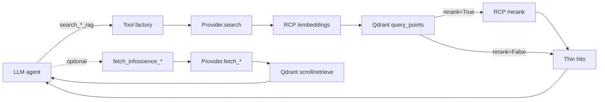

# V2 RAG Agent Tools

LLM agents in the v2 pipeline can query several Qdrant-backed indices on
demand: Infoscience, ETH Research Collection, HuggingFace Hub, OpenAlex,
Zenodo, ORCID, ROR, SWISSUbase, RenkuLab, **GitHub repositories**, and
the **EPFL Graph academic-discipline ontology**. Each index has a thin
async **provider** in
`src/v2/ingest/providers/*_rag.py` and one or more **pydantic-ai tools** in
`src/v2/agents/llm/agent_tools/*_rag.py`.

There is also a **federated layer** (`FederatedRagProvider`, two tools:
`search_federated_rag` and `lookup_entity_federated`) that fans out across
every index in parallel and merges results — the right default when
the agent doesn't know which index has the answer. See
[`federated-search.md`](federated-search.md) for the full design.

The pattern is uniform: `embed query → vector search Qdrant → optional
cross-encoder rerank → return thin hits`. Bulky payload bodies are kept
out of the prompt; agents pull full content with a separate fetch tool
when needed.

## The indices

| Provider | Tools | Collections | Filter keys (allowlist) |
|---|---|---|---|
| `InfoscienceRagProvider` (`src/v2/ingest/providers/infoscience_rag.py`) | `search_infoscience_rag`, `fetch_infoscience_chunks`, `fetch_infoscience_records` | `chunks`, `articles`, `persons`, `organizations` | `has_github_match, has_hf_match, year, publication_type, language, lab_uuid, org_uuids, doi, orcid, ror_id, sciper_id, sciper_unit_id, author_uuids, subjects, keywords` |
| `EthzResearchCollectionRagProvider` (`src/v2/ingest/providers/ethz_research_collection_rag.py`) | `search_ethz_research_collection_rag`, `fetch_ethz_research_collection_chunks`, `fetch_ethz_research_collection_records` | `chunks`, `articles`, `persons`, `organizations` | `has_github_match, has_hf_match, year, publication_type, language, lab_uuid, org_uuids, doi, orcid, ror_id, author_uuids, subjects, keywords` (sciper_* dropped — EPFL-specific) |
| `HuggingFaceRagProvider` (`src/v2/ingest/providers/huggingface_rag.py`) | `search_huggingface_rag`, `lineage_huggingface` | `models`, `datasets`, `spaces`, `orgs` | `library_name, pipeline_tag, sdk, gated, downloads, downloads_all_time, likes, author, license, entity_type, base_model` |
| `OpenAlexRagProvider` (`src/v2/ingest/providers/openalex_rag.py`) | `search_openalex_rag` | `works`, `authors`, `institutions`, `sources`, `topics`, `concepts` | `year, publication_year, doi, entity_type, openalex_id, country_code, type, field_id, domain_id, level, primary_topic_id, primary_source_id, last_known_institution_id, orcid, ror` |
| `ZenodoRagProvider` (`src/v2/ingest/providers/zenodo_rag.py`) | `search_zenodo_rag`, `fetch_zenodo_records` | `zenodo_records` | `year, doi, resource_type, access_right, entity_type, zenodo_id`. `fetch_zenodo_records(ids)` accepts both `zenodo_id` (canonical version-record) and `concept_recid` (parent / "all versions" id Zenodo redirects from), reading full bodies — title, doi, description, license, dates — from DuckDB rather than Qdrant. Use after `search_zenodo_rag` to hydrate hits, or to confirm a citation by id. See [`zenodo-index.md`](zenodo-index.md). |
| `OrcidRagProvider` (`src/v2/ingest/providers/orcid_rag.py`) | `search_orcid_rag` | `persons`, `employments`, `educations` (collections namespaced by scope, e.g. `orcid_epfl_persons`) | `orcid_id, in_scope, discovered_via, org_ror, organization, department, role` |
| `RorRagProvider` (`src/v2/ingest/providers/ror_rag.py`) | `search_ror_rag` | `epfl_ethz`, `switzerland`, `europe`, `worldwide` (scope mode → collection `ror_<scope>`) | only `country_code` (the upstream ROR store has a fixed-shape filter) |
| `RenkulabRagProvider` (`src/v2/ingest/providers/renkulab_rag.py`) | `search_renkulab_rag` | `renkulab_projects`, `renkulab_groups`, `renkulab_users`, `renkulab_data_connectors` | `entity_type, slug, namespace, path, visibility, storage_type, storage_provider, entity_id`. The tool also accepts an `entity_types` list to scope the search to a subset of the four collections (default: all four, results merged + reranked together). |
| `SwissubaseRagProvider` (`src/v2/ingest/providers/swissubase_rag.py`) | `search_swissubase_rag` | `swissubase_entities` (single collection; `entity_type` payload disambiguates `studies` / `datasets` / `persons` / `institutions`) | `entity_type, study_id, dataset_id, person_key, institution_key, ref, main_discipline, sub_discipline, progress, year_start, year_end, access_right`. Backed by `src/index/swissubase/` (Selenium-driven ingest of the swissUbase social-science research-data platform: 18k+ studies via direct studyVersionId enumeration since the search endpoint caps at 250 items). Default `INDEX_SWISSUBASE_SCOPE=epfl_sdsc_ethz` ingests every study but only embeds those whose institution string matches EPFL / ETHZ / SDSC. Every hit carries the canonical `https://www.swissubase.ch/...` URL in `source_url`. Wired into the **article agent**. |
| `SnsfRagProvider` (`src/v2/ingest/providers/snsf_rag.py`) | `search_snsf_rag` | `epfl`, `ethz`, `switzerland` (scope mode → collection `snsf_<scope>`) | `institution` (exact match on `research_institution`, e.g. `EPF Lausanne – EPFL`), `institute` (substring on the lab/centre name, resolved from DuckDB after the ANN — surgical for SDSC-style queries), `discipline_l1`, `state` (PascalCase: `Completed` / `Ongoing` / `Approved`). Other keys dropped with a warning. Backed by `src/index/snsf/` (Qwen3-Embedding-8B over title + discipline + keywords + abstract); the bulk CSV ingest covers every SNSF P3 grant from 1975–2027 (~90 k records). Wired into the **person** and **organization** agents — useful to ground a researcher's funding history or to attribute a project to its host institute. |
| `GitHubRagProvider` (`src/v2/ingest/providers/github_rag.py`) | `search_github_rag` | `github_repos` | `entity_type, repo_id, owner, primary_language, license_spdx, is_archived, is_fork`. Backed by the deterministic, REST-fed `src/index/github/` corpus (EPFL/Swiss-research repos: metadata + README chunks, Qwen3-Embedding-8B). Wired into the **repository agent** so the LLM can find related implementations / canonical forks while reasoning about the repo it is processing. |
| `EpflGraphRagProvider` (`src/v2/ingest/providers/epfl_graph_rag.py`) | `search_epfl_graph_disciplines` | `epfl_graph_disciplines` (single collection, one point per ontology category) | `category_id, depth, parent_id, entity_type`. Backed by `src/index/epfl_graph/` — ~2226 EPFL Graph academic-discipline categories (depth 1..5) with embeddings built from `name + canonical Wikipedia lead-section + top anchor concept names`. Wired into the **repository, person, organization, and article** LLM agents. Use `filters={"depth": 4}` to keep only leaf disciplines and skip broad ancestor nodes. |
| `FederatedRagProvider` (`src/v2/ingest/providers/federated_rag.py`) | `search_federated_rag`, `lookup_entity_federated` | wraps **12** indices (HuggingFace, OpenAlex, Infoscience, ORCID, ROR, Zenodo, ETH Research Collection, GitHub, SNSF, RenkuLab, EPFL Graph, SWISSUbase) | forwarded as-is to every adapter — each picks up the keys it knows, ignores the rest. `search_federated_rag(rerank=True)` engages the cross-index reranker. |

Infoscience and the ETH Research Collection are DSpace-based sister
indices with chunked bodies — search hits return a short snippet plus an
`article_uuid` the agent can pass to `fetch_*_chunks` for the full text.
The other indices already return complete records from search.

## Tool flow



`search` returns a list of small dicts (id + score + identifiers + a
≤320-char snippet for the indices that index body text). The agent can
then call `fetch_infoscience_chunks(article_uuid)` /
`fetch_infoscience_records(collection, ids)` to spend context on the full
body only for the hit that looks promising.

## Filter dict format

All `search_*_rag` tools accept the same operator dict (the per-store
quirks are translated by `_rag_helpers.to_simple_filter_payload`):

| Operator / shape | Meaning | Example |
|---|---|---|
| scalar | `field == value` | `{"year": 2024}` |
| `[v1, v2, …]` or `{"$in": […]}` | `field` ∈ list | `{"library_name": ["transformers", "diffusers"]}` |
| `{"$gte": X, "$lte": Y}` | range | `{"downloads": {"$gte": 1000}}` |
| `{"$eq": v}` | explicit equals | `{"country_code": {"$eq": "CH"}}` |
| `{"$ne": v}` | infoscience only | `{"publication_type": {"$ne": "thesis"}}` |
| `{"$contains": "needle"}` | infoscience only (list-of-string fields) | `{"keywords": {"$contains": "drug"}}` |

Keys not in a provider's allowlist are dropped with a warning before the
filter reaches Qdrant — see the table above. Operators not supported by a
backend (e.g. `$ne` outside infoscience) are also dropped with a
warning. ROR is the strictest: only `country_code` is honoured.

## Hit shape

Search hits are small dicts intended for the LLM to skim. The exact keys
vary by index but always include `id`, `score`, and a short
identifier-like key (`repo_id`, `openalex_id`, `zenodo_id`, `orcid_id`,
`ror_id`, …). Indices with body text also include
`snippet` (first ~320 chars of `text` / `abstract` / `biography`).

```python
# example: search_huggingface_rag(query=…, collection="models", top_k=3)
[
  {
    "id": "0a4f…",
    "score": 0.91,
    "collection": "models",
    "repo_id": "ZurichNLP/swissbert",
    "author": "ZurichNLP",
    "library_name": "transformers",
    "pipeline_tag": "fill-mask",
    "downloads": 1024,
    "likes": 17,
  },
  …
]
```

## Reranker

`rerank=True` widens the vector top-k by `RERANK_CANDIDATE_MULTIPLIER ×
top_k` (floored at 30) and runs `Qwen/Qwen3-Reranker-8B` over the
candidates. It's slower (one extra RCP call, hundreds of ms) but more
precise — useful for ambiguous semantic queries, less so for exact-id
lookups. Default off; the agent opts in.

When the indexed payload doesn't carry body text (e.g. HF chunks only
have metadata) the provider builds a synthetic doc string from
`repo_id` + `library_name`/`sdk` so the reranker still has something to
score against. Empty docs are replaced with a single space
(`safe_rerank_documents`) — the reranker rejects empty inputs.

## Configuration

Each provider is gated by a `V2_<INDEX>_RAG_ENABLED` flag (all default
`true`). The full table:

| Var | Default | Effect |
|---|---|---|
| `V2_INFOSCIENCE_RAG_ENABLED` | `true` | enables Infoscience tools |
| `V2_ETHZ_RESEARCH_COLLECTION_RAG_ENABLED` | `true` | enables ETH Research Collection tools |
| `V2_HUGGINGFACE_RAG_ENABLED` | `true` | enables HF Hub tool |
| `V2_OPENALEX_RAG_ENABLED` | `true` | enables OpenAlex tool |
| `V2_ZENODO_RAG_ENABLED` | `true` | enables Zenodo tool |
| `V2_ORCID_RAG_ENABLED` | `true` | enables ORCID tool |
| `V2_ROR_RAG_ENABLED` | `true` | enables ROR tool |
| `V2_SNSF_RAG_ENABLED` | `true` | enables SNSF P3 tool |
| `INDEX_QDRANT_URL` | yaml default per index | Qdrant endpoint. Inside the devcontainer use `http://gme-qdrant:6333` |
| `INDEX_QDRANT_API_KEY` | unset | Qdrant API key |
| `RCP_TOKEN` | required for embed/rerank | EPFL RCP inference endpoint token |
| `INFOSCIENCE_TOKEN` | unset | only for protected Infoscience read paths |
| `ETHZ_RESEARCH_COLLECTION_TOKEN` | unset | only for protected ETH Research Collection read paths |

Construction is best-effort: missing config, unreachable Qdrant, missing
RCP token, or a missing collection all yield `None` (or empty results)
without raising. The rest of the v2 pipeline keeps running without RAG.

## Wiring into agents

The five non-Infoscience providers are not auto-wired to any agent — each
agent's prompt budget is finite and adding 5 more tools to every prompt
risks bloating the system prompt. Wire by hand inside the agent's
`run()` method, guarded on `providers.<field>` being non-`None`:

```python
# inside e.g. src/v2/agents/llm/article/agent.py
if providers.openalex_rag is not None:
    tools.append(make_openalex_rag_search_tool(providers.openalex_rag))
if providers.zenodo_rag is not None:
    tools.append(make_zenodo_rag_search_tool(providers.zenodo_rag))
```

Recommended pairings:

| Agent | Tools to add |
|---|---|
| `article` | `openalex_rag` (works), `zenodo_rag`, `renkulab_rag`, `epfl_graph_rag` (discipline tagging) |
| `person` | `orcid_rag`, `openalex_rag` (authors), `epfl_graph_rag` (researcher → primary discipline) |
| `organization` | `ror_rag`, `huggingface_rag` (orgs), `openalex_rag` (institutions), `renkulab_rag` (groups), `epfl_graph_rag` (lab/unit → primary discipline) |
| `repository` | `huggingface_rag` (models/datasets), `renkulab_rag` (projects), `epfl_graph_rag` (README → discipline) |
| `contribution`, `membership` | (none — pure linking agents) |

Infoscience and ETH Research Collection are already wired into article /
person / organization agents (the two DSpace-based institutional
repositories cover EPFL + ETHZ outputs respectively).

## Federated tools — picking up ETH RC alongside everything else

`search_federated_rag` is the LLM-facing wrapper over `FederatedRagProvider`.
It fans out to every adapter that's loaded — including the ETH Research
Collection one — and returns one merged hit list:

```python
# What the LLM sees in the tool response
{
  "hits": [
    {"index": "huggingface", "entity_type": "model",
     "id": "ZurichNLP/swissbert", "score": 0.87, "title": "ZurichNLP/swissbert",
     "url": "https://huggingface.co/ZurichNLP/swissbert", "payload": {...}},
    {"index": "ethz_research_collection", "entity_type": "chunk",
     "id": "941936d3-…", "score": 0.85,
     "title": "...", "summary": "first 200 chars of the chunk text",
     "payload": {"article_uuid": "...", "chunk_index": 7, ...}},
    ...
  ],
  "by_index": {"huggingface": 3, "ethz_research_collection": 3,
               "infoscience": 2, "openalex": 0, ...},
  "errors": {},
}
```

Restrict the fan-out with `indices=[…]` when the agent already knows where
to look — e.g. `["ethz_research_collection", "infoscience"]` to query the
two DSpace-based institutional repositories side by side. Cross-index
identifier resolution (`lookup_entity_federated`) recognises ETH RC
handles (`20.500.11850/...`) and full `research-collection.ethz.ch` URLs.

## Telemetry

Each tool call records a `record_query(service="<index>.rag.search.<collection>", query=…)` entry on the per-request `QueryLog`. The
log is written to `${V2_QUERY_LOG_DIR}/${run_id}.json` at the end of
`/v2/extract`. Useful for measuring which indices the agents actually
reach for. The federated tool emits `federated.rag.search` /
`federated.rag.lookup` so you can distinguish a fan-out call from the
per-index calls each adapter makes downstream.

## Adding a new index

The shape every provider needs to satisfy:

1. **Wrap a Qdrant store** — anything with a `search(collection, *,
   query_vector, top_k, ...)` method works.
2. **Wrap an embedder** — async callable returning `list[float]` for one
   query.
3. **Optional reranker** — async callable returning `list[{index,
   relevance_score}]`.
4. **Define a `_ALLOWED_FILTER_KEYS` frozenset** — anything not in here
   is dropped with a warning.
5. **Define a per-collection `_THIN_KEYS`** tuple — fields copied from
   the Qdrant payload into the LLM-facing hit.
6. **Use `_rag_helpers`** for `filter_allowlist`,
   `to_simple_filter_payload`, `expand_candidate_k`,
   `apply_rerank_indices`, `safe_rerank_documents`, `make_snippet`,
   `thin_payload`, `env_enabled`. Avoid re-implementing.
7. **Provide `build_default_provider()`** gated by `env_enabled("V2_<INDEX>_RAG_ENABLED")` and best-effort (return `None` on any error).
8. **Wire into `ProviderSet`** (`src/v2/agents/models.py:168`) and
   `dependencies.py:_resolve_rag_provider`.
9. **Export the tool factory** from `src/v2/agents/llm/agent_tools/__init__.py`.

`src/v2/ingest/providers/zenodo_rag.py` is the simplest reference (single
collection, reuses OpenAlex's clients, ~150 lines).

## Code map

```
src/v2/ingest/providers/
  _rag_helpers.py            # filter allowlist / operator translation /
                              # candidate expansion / rerank reorder /
                              # snippet truncation / env toggle
  infoscience_rag.py         # search + fetch_chunks + fetch_records
  ethz_research_collection_rag.py  # search + fetch_chunks + fetch_records
                                    # (sister DSpace index to infoscience)
  huggingface_rag.py         # search + lineage (models/datasets/spaces/orgs)
  openalex_rag.py            # search (6 entity collections)
  zenodo_rag.py              # search + fetch_records
  orcid_rag.py               # search (persons/employments/educations)
  ror_rag.py                 # search (4 scope modes; country_code only)
  github_rag.py              # search (Swiss/EPFL repo seed)
  snsf_rag.py                # search (grants + people + institutions)
  renkulab_rag.py            # search (projects/groups/users/data_connectors)
  swissubase_rag.py          # search (studies/datasets/persons/institutions)
  epfl_graph_rag.py          # search (EPFL discipline ontology)
  federated_rag.py           # search + lookup; fans out to every adapter

src/v2/agents/llm/agent_tools/
  infoscience_rag.py         # 3 tools
  ethz_research_collection_rag.py  # 3 tools (search + fetch_chunks + fetch_records)
  huggingface_rag.py         # 1 tool (+ lineage helper)
  openalex_rag.py            # 1 tool
  zenodo_rag.py              # 2 tools (search + fetch_records)
  orcid_rag.py               # 1 tool
  ror_rag.py                 # 1 tool
  github_rag.py              # 1 tool
  snsf_rag.py                # 1 tool
  renkulab_rag.py            # 1 tool
  swissubase_rag.py          # 1 tool
  epfl_graph_rag.py          # 1 tool
  federated_rag.py           # 2 tools (search_federated_rag + lookup_entity_federated)

src/v2/dependencies.py       # _resolve_rag_provider + ProviderSet builder
src/v2/agents/models.py      # ProviderSet (12 per-index *_rag fields + federated_rag)
```

## Tests

| File | Covers |
|---|---|
| `tests/v2/test_llm_rag_helpers.py` | `_rag_helpers` (filter allowlist, operator translation, candidate expansion, rerank reorder, snippet, thin payload). |
| `tests/v2/test_llm_infoscience_rag_tool.py` | Infoscience search/fetch flows + tool factories. |
| `tests/v2/test_llm_ethz_research_collection_rag_tool.py` | ETH Research Collection search/fetch flows + tool factories. |
| `tests/v2/test_llm_huggingface_rag_tool.py` | HF collection routing, allowlist, missing-collection skip, rerank reorder. |
| `tests/v2/test_llm_other_rag_tools.py` | OpenAlex, Zenodo, ORCID, ROR — including ROR's country-only filter and graceful empty on missing collections. |

Tests use fake stores / embedders / rerankers and never hit Qdrant or
RCP — fast and deterministic.
